# BambiKam Easy V8.11 03.07.2021

> Bitte folgende Punkte beachten: [Wichtige/wissenswerte Punkte](#wichtigewissenswerte-punkte)

> Wo möchten Sie einsteigen?
> - [Bausatz zusammenbauen](#bausatz-zusammenbauen)
> - [Montage der Kamera (Endmontage)](#montage-der-kamera-endmontage)

- [BambiKam für DJI Mavic Pro (Platinum)](#bambikam-für-dji-mavic-pro-platinum)
- [BambiKam für DJI Mavic 2 Pro/Zoom](#bambikam-für-dji-mavic-2-prozoom)
- [Was ist BambiKam?](#was-ist-bambikam)
- [Warum wurde BambiKam Easy entworfen?](#warum-wurde-bambikam-easy-entworfen)
- [Zeig her die Bilder! Ich will sehen wie's aussieht!](#zeig-her-die-bilder-ich-will-sehen-wies-aussieht)
- [Was zeichnet BambiKam Easy aus?](#was-zeichnet-bambikam-easy-aus)
- [Müssen an der Mavic 1 Modifikationen vorgenommen werden?](#müssen-an-der-mavic-1-modifikationen-vorgenommen-werden)
- [Kann die BambiKam Easy auch an die Mavic 2 befestigt werden?](#kann-die-bambikam-easy-auch-an-die-mavic-2-befestigt-werden)
- [Lizenz](#lizenz)
- [Konfiguration der BambiKam Easy](#konfiguration-der-bambikam-easy)
- [Materialien](#materialien)
  - [Aviatik-Sperrholz 2mm](#aviatik-sperrholz-2mm)
  - [3D-Druck](#3d-druck)
- [Anfertigen der BambiKam Easy](#anfertigen-der-bambikam-easy)
  - [DJI Mavic Pro/Platinum mit FLIR Boson 320 50° oder 34°-Kamera](#dji-mavic-proplatinum-mit-flir-boson-320-50-oder-34-kamera)
    - [Lasern von Aviatik-Sperrholz 2mm für DJI Mavic Pro/Platinum mit FLIR Boson 320 50° oder 34°-Kamera](#lasern-von-aviatik-sperrholz-2mm-für-dji-mavic-proplatinum-mit-flir-boson-320-50-oder-34-kamera)
    - [3D-Druck des Splintens für die Befestigung an der Mavic 1](#3d-druck-des-splintens-für-die-befestigung-an-der-mavic-1)
  - [DJI Mavic 2 Pro/Zoom mit FLIR Boson 320 50° oder 34°-Kamera](#dji-mavic-2-prozoom-mit-flir-boson-320-50-oder-34-kamera)
    - [Lasern von Aviatik-Sperrholz 2mm für DJI Mavic 2 Pro/Zoom mit FLIR Boson 320 50° oder 34°-Kamera](#lasern-von-aviatik-sperrholz-2mm-für-dji-mavic-2-prozoom-mit-flir-boson-320-50-oder-34-kamera)
    - [3D-Druck des Splintens für die Befestigung an der Mavic 2](#3d-druck-des-splintens-für-die-befestigung-an-der-mavic-2)
  - [DJI Mavic 2 Pro/Zoom mit Thermocam XT384](#dji-mavic-2-prozoom-mit-thermocam-xt384)
    - [Lasern von Aviatik-Sperrholz 2mm für DJI Mavic 2 Pro/Zoom mit Thermocam XT384](#lasern-von-aviatik-sperrholz-2mm-für-dji-mavic-2-prozoom-mit-thermocam-xt384)
    - [3D-Druck des Splintens für die Befestigung an der Mavic 2](#3d-druck-des-splintens-für-die-befestigung-an-der-mavic-2-1)
  - [Kamerahalterung drucken](#kamerahalterung-drucken)
    - [Kamerahalterung drucken für die FLIR Boson 320 50° oder 34°-Kamera und dem Low Profile BOSON VPC Interface Module](#kamerahalterung-drucken-für-die-flir-boson-320-50-oder-34-kamera-und-dem-low-profile-boson-vpc-interface-module)
  - [Gehäuse für Transmitter drucken](#gehäuse-für-transmitter-drucken)
    - [Gehäuse für Eachine TX801](#gehäuse-für-eachine-tx801)
    - [Gehäuse für SpeedyBee VTX-DVR](#gehäuse-für-speedybee-vtx-dvr)
    - [Gehäuse für TBS Unify Pro 5G8 HV](#gehäuse-für-tbs-unify-pro-5g8-hv)
- [Bausatz zusammenbauen](#bausatz-zusammenbauen)
  - [Abstandhalter auf Grundplatte (Mitte)](#abstandhalter-auf-grundplatte-mitte)
  - [Aufhängung für die Kamera (Rechts)](#aufhängung-für-die-kamera-rechts)
  - [Lackieren der BambiKam Easy](#lackieren-der-bambikam-easy)
  - [Anbringen des Transmittergehäuses](#anbringen-des-transmittergehäuses)
    - [Transmittergehäuse für den Eachine TX801-Transmitter](#transmittergehäuse-für-den-eachine-tx801-transmitter)
    - [Transmittergehäuse für den SpeedyBee VTX-DVR-Transmitter](#transmittergehäuse-für-den-speedybee-vtx-dvr-transmitter)
    - [Transmittergehäuse für den TBS Unify Pro 5G8 HV](#transmittergehäuse-für-den-tbs-unify-pro-5g8-hv)
    - [Löten der Verbindungskabel für den TX801-Transmitter](#löten-der-verbindungskabel-für-den-tx801-transmitter)
    - [Löten der Verbindungskabel für den SpeedyBee VTX-DVR-Transmitter](#löten-der-verbindungskabel-für-den-speedybee-vtx-dvr-transmitter)
    - [Löten der Verbindungskabel für den TBS Unify Pro 5G8 HV-Transmitter](#löten-der-verbindungskabel-für-den-tbs-unify-pro-5g8-hv-transmitter)
  - [Verlegen der Kabel](#verlegen-der-kabel)
  - [Sender und Antenne montieren](#sender-und-antenne-montieren)
- [Montage der Kamera (Endmontage)](#montage-der-kamera-endmontage)
  - [Kamera montieren](#kamera-montieren)
- [Anbringen der Grundplatte an den Kopter](#anbringen-der-grundplatte-an-den-kopter)
- [Fliegen](#fliegen)
- [Wichtige/wissenswerte Punkte](#wichtigewissenswerte-punkte)
- [Testflug mit der BambiKam V6](#testflug-mit-der-bambikam-v6)

## BambiKam für DJI Mavic Pro (Platinum)

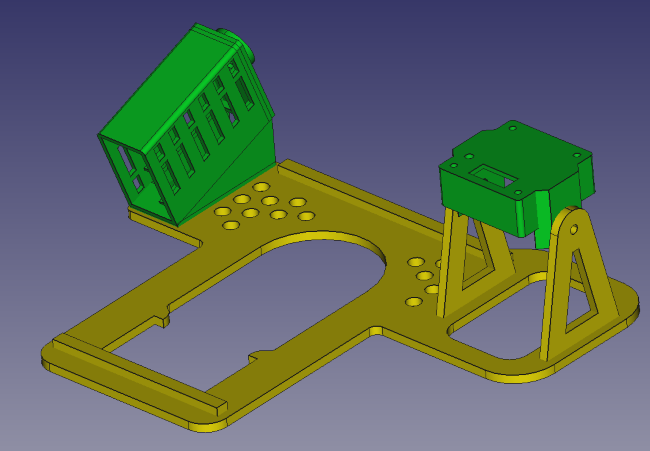

## BambiKam für DJI Mavic 2 Pro/Zoom

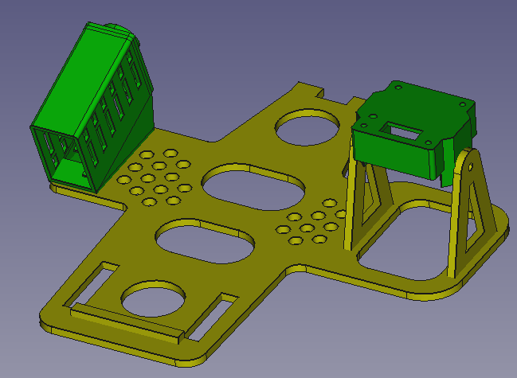

## Was ist BambiKam?

BambiKam ist eine Plattform, welche es erlaubt eine [FLIR BOSON](http://www.flir.de/cores/boson/) Wärmebildkamera zusammen mit einem [Eachine TX801-Sender](https://www.google.com/search?q=eachine%20tx801) und einer [Cloverleaf](https://www.google.com/search?q=align+cloverleaf+5.8+ghz)-Antenne an eine [DJI Mavic Pro/Platinum](https://www.google.com/search?q=dji+mavic+pro+platinum) oder an eine [DJI Mavic 2 Pro/Zoom](https://www.google.com/search?q=dji+mavic+2+pro) zu befestigen.

Wahlweise ist es auch möglich, einen [SpeedyBee VTX-DVR](https://www.speedybee.com/speedy-bee-vtx-dvr/)-Transmitter zu verwenden. Dieser erlaubt es, das Videosignal direkt auf eine MicroSD-Karte aufzuzeichnen. Dazu muss das alternative Gehäuse verwendet werden. Die Grundplatte ist identisch. (Hinweis: Dieser Transmitter hatte zu wenig Absatz und wird deshalb von der Herstellerfirma nicht mehr produziert.)

## Warum wurde BambiKam Easy entworfen?

BambiKam Easy wurde für die Rehkitzsuche (siehe auch [Rehkitzrettung Schweiz](https://www.rehkitzrettung.ch/)) entworfen. Damit die Mavic mit dem Velo transportiert werden könnte, ist es wichtig, dass sie nicht mehr Platz braucht als wirklich nötig. Die Mavic kann so im nicht gefalteten Zustand in einen Koffer verstaut werden.

## Zeig her die Bilder! Ich will sehen wie's aussieht!

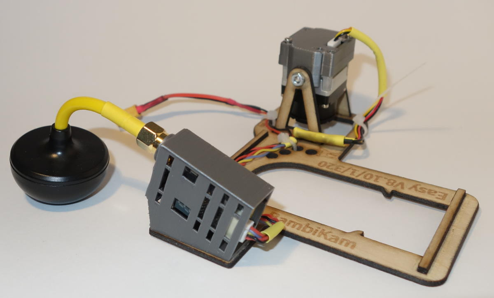
BambiKam Easy für DJI Mavic Pro (oder Platinum), FLIR Boson 320/50°-Wärmebildkamera, Eachine TX801-Transmitter und direktem Stromanschluss an die angepasste Mavic.

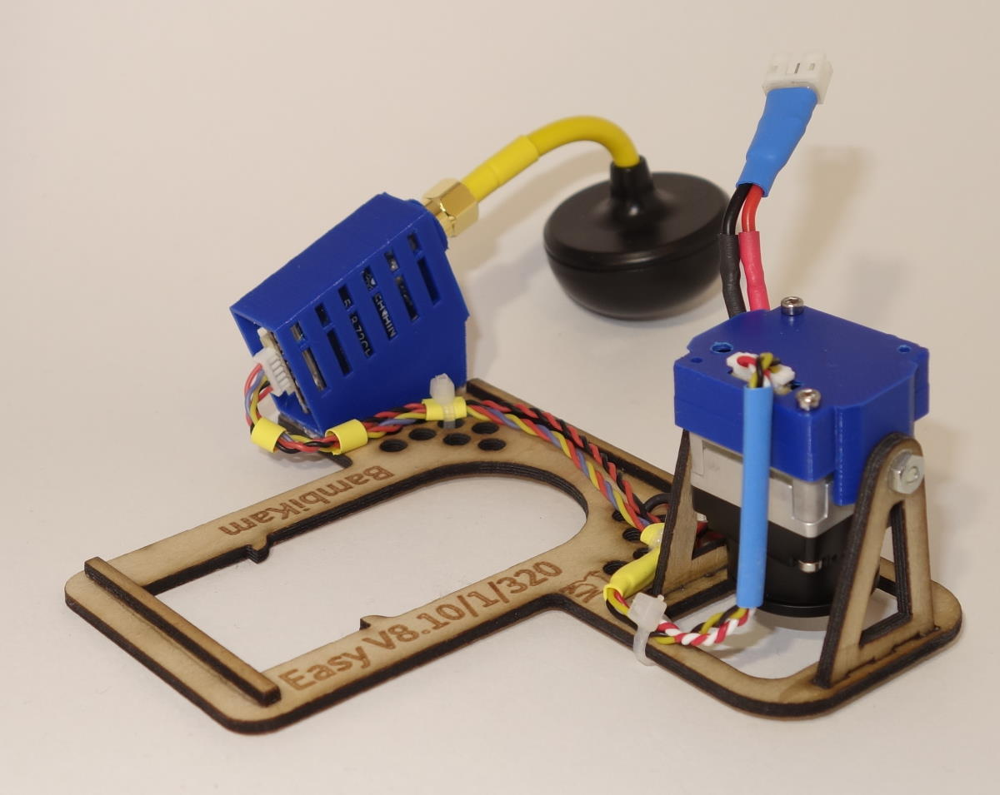
BambiKam Easy für DJI Mavic Pro (oder Platinum), FLIR Boson 320/50°-Wärmebildkamera, Eachine TX801-Transmitter und Speisung via Akkus.

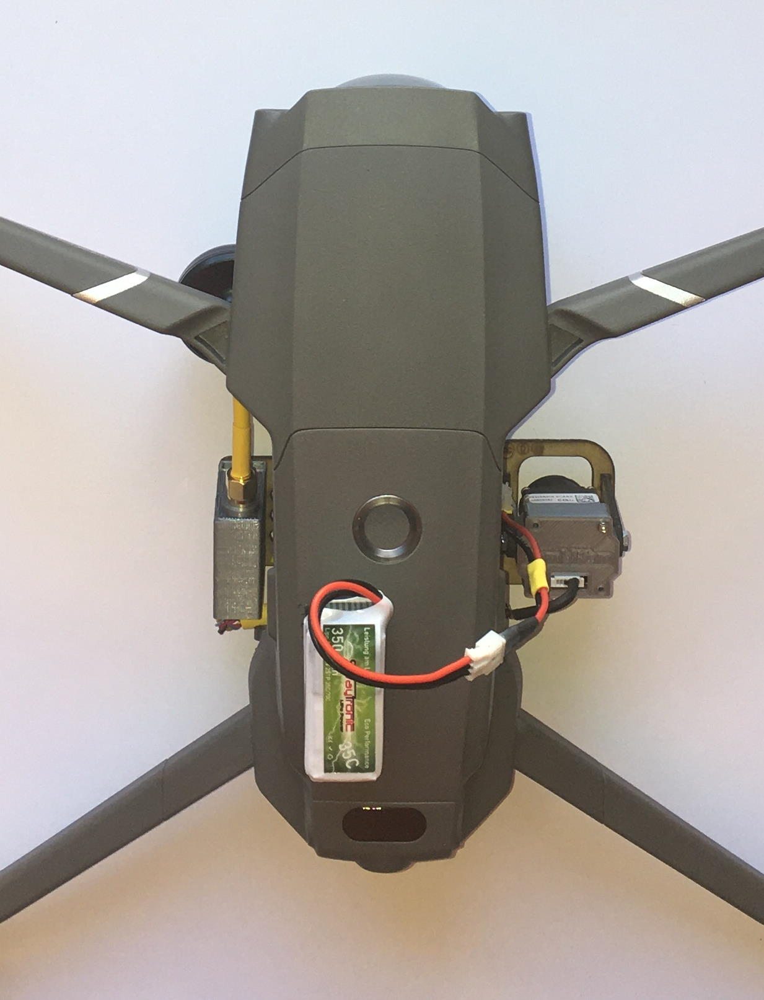

BambiKam Easy für DJI Mavic 2 Pro/Zoom, FLIR Boson 320/50°-Wärmebildkamera, Eachine TX801-Transmitter und Speisung via Akkus.

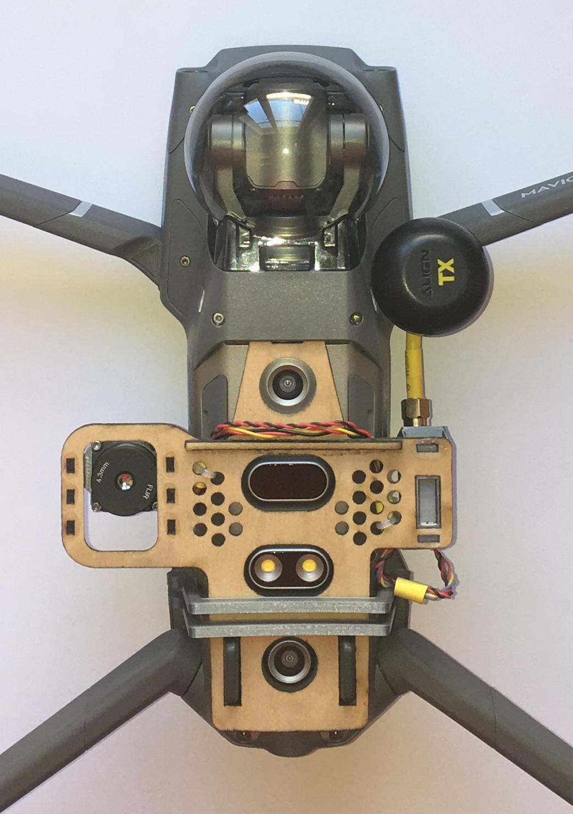

BambiKam Easy für DJI Mavic 2 Pro/Zoom, FLIR Boson 320/50°-Wärmebildkamera, Eachine TX801-Transmitter und Speisung via Akkus.

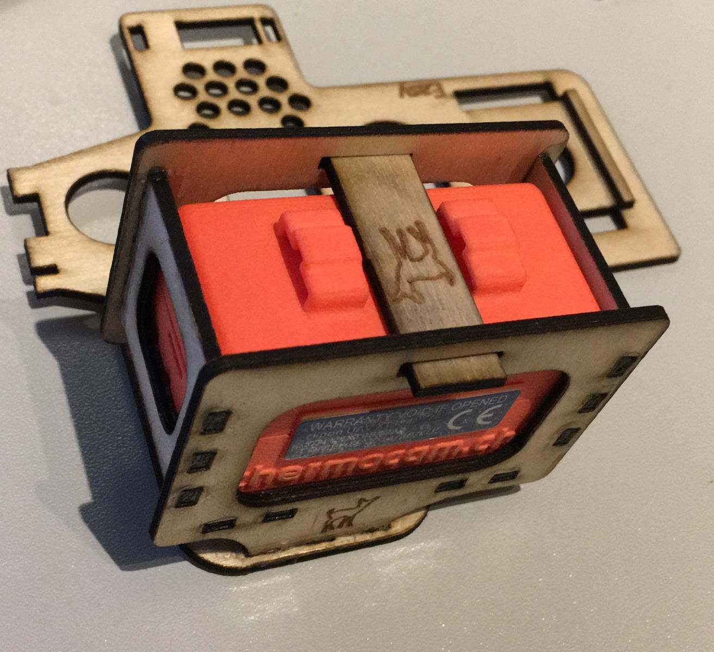

BambiKam Easy für DJI Mavic 2 Pro/Zoom, Thermocam XT384-Wärmebildkamera

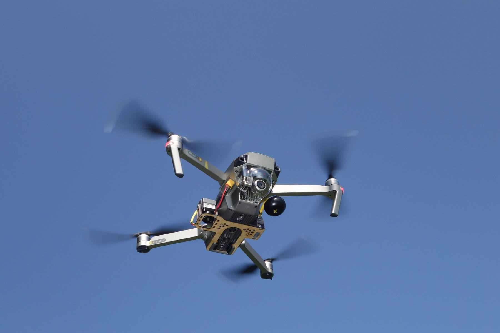

Fliegende DJI Mavic Pro Platinum mit BambiKam Easy und FLIR Boson 320/50°-Wärmebildkamera, Eachine TX801-Transmitter und direkter Stromversorgung.

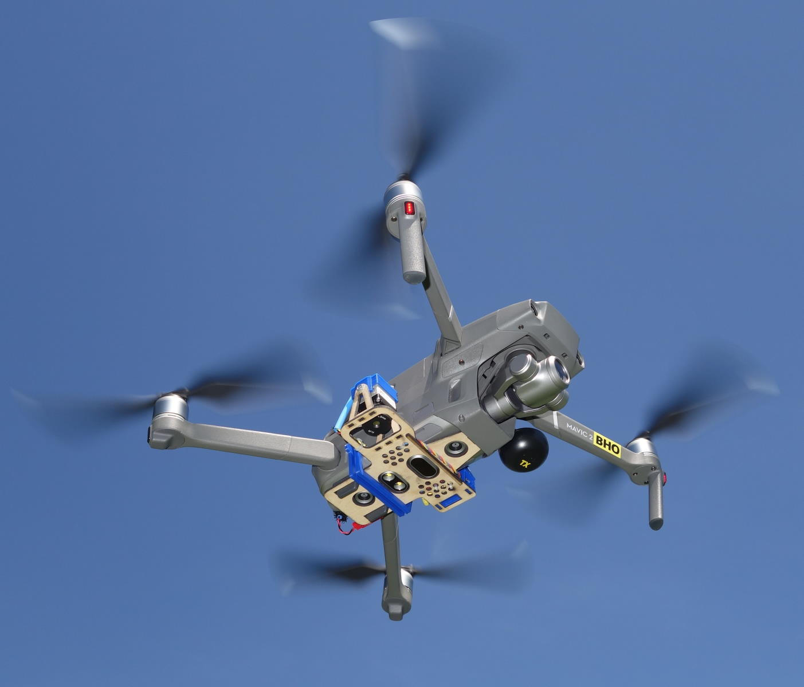

Fliegende DJI Mavic 2 Zoom mit BambiKam Easy und FLIR Boson 320/50°-Wärmebildkamera, Eachine TX801-Transmitter und direkter Stromversorgung.

## Was zeichnet BambiKam Easy aus?

- Inklusive Kamera, Sender und Antenne beträgt das Gewicht weniger als 65 Gramm.
- Durch das Anbringen der Kamera, Sender und Antenne auf der Seite kann auf Verlängerungen verzichtet werden. Dies spart ebenfalls Gewicht und macht die Drohne nicht höher.
- Durch die einfache Befestigung der Grundplatte an den hinteren Landekufen der Mavic ist es ganz einfach, die BambiKam Easy zu entfernen und diese so als ganz normale Drohne zu verwenden.
- Die Grundplatte hat Löcher, welche die Sensoren der Mavic nicht beeinträchtigen. So ist es möglich, auch nach dem Anbringen der BambiKam Easy, die Mavic mit Hilfe der Sensoren zu landen.

## Müssen an der Mavic 1 Modifikationen vorgenommen werden?

Jein. Durch die Tatsache, dass eine separate Stromversorgung wiederum Gewicht bedeutet und schon eine Stromversorgung der Drohne vorhanden ist, welche verwendet werden kann, um den Sender und die Kamera mit Strom zu versorgen, ist es eine Überlegung wert, die Stromversorgung des Quadcopters anzuzapfen. Selbstverständlich muss man sich der Tatsache bewusst sein, dass dies Auswirkung auf die Herstellergarantie haben kann.

Der Stromverbrauch des Senders und der Kamera ist sehr klein und beeinflusst die Flugzeit minimal.

Die BambiKam Easy sieht keine Halterung für einen separaten Akku vor.

Es besteht jedoch die Möglichkeit, dass auf den Akku der Mavic noch ein separater Akku aufgeklebt wird. Dieser Akku würde dann für die Speisung des Transmitters und der Wärmebildkamera zuständig sein.

Für eine separate Stromversorgung wären folgende Komponenten nötig:

- Akkus (Es wird empfholen, für jeden Mavic Akku ein kleiner Akku anzuschaffen): [https://www.swaytronic.ch/LiPo-Akku---Swaytronic/LiPo-Akku-2S-7-4V/2S-7-4V---35C---70C/swaytronic-lipo-2s-7-4v-350mah-35c-70c-jst-phr-3pt.html](https://www.swaytronic.ch/LiPo-Akku---Swaytronic/LiPo-Akku-2S-7-4V/2S-7-4V---35C---70C/swaytronic-lipo-2s-7-4v-350mah-35c-70c-jst-phr-3pt.html)
- Adapterkabel (Ein Adapterkabel wird auseinandergeschnitten und für die Speisung der BambiKam verwendet. Weitere werden benötigt fürs Laden (Maximal 4)). [https://www.swaytronic.ch/LiPo---Zubehoer/LiPo-Adapterkabel/adapterkabel-ph-3p-maennlich-zu-xh-3p-weiblich-2s.html](https://www.swaytronic.ch/LiPo---Zubehoer/LiPo-Adapterkabel/adapterkabel-ph-3p-maennlich-zu-xh-3p-weiblich-2s.html)
- Verlängerungskabel (Damit die Akkus auf dem Akku kleben bleiben können, wird empfohlen, ein zusätzliches Verlängerungskabel pro Ladeplatz anzuschaffen (Maximal 4).) [https://www.swaytronic.ch/LiPo---Zubehoer/Balancer-Verlaengerungskabel/XH/balancer-verlaengerung-xh-10cm-2s.html](https://www.swaytronic.ch/LiPo---Zubehoer/Balancer-Verlaengerungskabel/XH/balancer-verlaengerung-xh-10cm-2s.html)
- Ladegerät (Ermöglicht das Laden der kleinen LiPo-Akkus.) [https://www.swaytronic.ch/Ladegeraete/Ladegeraete-12V-DC/ups4-ac-dc-charger.html](https://www.swaytronic.ch/Ladegeraete/Ladegeraete-12V-DC/ups4-ac-dc-charger.html)

## Kann die BambiKam Easy auch an die Mavic 2 befestigt werden?

Ja, die BambiKam Easy ist auch an die die Mavic 2 angepasst. Der Strom kann direkt vom Kopter bezogen werden und es sind keine Eingriffe in den Kopter nötig.

## Lizenz

BambiKam Easy steht unter der Lizenz [CC BY SA](https://creativecommons.org/licenses/by-sa/3.0/ch/) und darf somit beliebig kopiert, verändert und geteilt werden unter der Bedingung, dass diese Änderungen wiederum geteilt werden und ein Hinweis auf das Ursprungsprojekt gegeben wird.

Es wird keine Verantwortung übernommen.

## Konfiguration der BambiKam Easy

Die BambiKam Easy kann für verschiedene Quadcopter, Kameras und Transmitter aufgebaut werden:

Quadcopter

- [DJI Mavic Pro](https://www.dji.com/mavic)
- [DJI Mavic Pro Platinum](https://www.dji.com/mavic-pro-platinum)
- [DJI Mavic 2 Pro](https://www.dji.com/mavic-2)
- [DJI Mavic 2 Zoom](https://www.dji.com/mavic-2)

Kameras [FLIR BOSON](http://www.flir.de/cores/boson/)

- FLIR Boson 320 50°
- FLIR Boson 320 34°
- Thermocam XT384

[Low Profile BOSON VPC Interface Module](https://www.oemcameras.com/rhp-bos-vpc-if.htm)

Einfaches Interface, welches das Bild der Kamera in ein Analogsignal umwandelt und zum Transmitter überträgt.

Plattformwahl

Die oben angeführten Quadcopter- und Kamera-Modelle lassen sich mit insgesamt drei verschiedenen Plattformen abdecken. Für die zwei verschiedenen Mavic-Modelle sind die Ausschnitte der Landekufen und Sensoren unterschiedlich.

|                | DJI Mavic Pro/Platinum                                              | DJI Mavic 2 Pro/Zoom                                              |
| -------------- | ------------------------------------------------------------------- | ----------------------------------------------------------------- |
| FLIR Boson 320 | [Link](#dji-mavic-proplatinum-mit-flir-boson-320-50-oder-34-kamera) | [Link](#dji-mavic-2-prozoom-mit-flir-boson-320-50-oder-34-kamera) |
| Thermocam XT384 | | [Link](#dji-mavic-2-prozoom-mit-thermocam-xt384) |

Transmitterwahl

Die Grundplatte kann drei verschiedene Transmittergehäuse aufnehmen. Die Wahl des Transmitters hat somit keine Auswirkung auf die Grundplatte.

- [Eachine TX801-Sender](https://www.google.com/search?q=eachine%20tx801)
- [SpeedyBee VTX-DVR](https://www.speedybee.com/speedy-bee-vtx-dvr/) (Hinweis: Wird nicht mehr hergestellt.)
- [TBS Unifiy Pro 5G8](https://www.team-blacksheep.com/products/prod:unify_pro_hv)

## Materialien

### Aviatik-Sperrholz 2mm

Der Hauptteil besteht aus Aviatik Sperrholz, 2mm. Dieses erhält man bei Coop Bau&Hobby.
Das Aviatik Sperrholz hat den Vorteil, dass es dünn, sehr stabil und vielschichtig verleimt ist.

### 3D-Druck

Die Kamerahalterung und das Gehäuse für den Transmitter werden im 3D-Druckverfahren hergestellt.

## Anfertigen der BambiKam Easy

Ist das Holz beschafft, so lässt sich die Form sehr einfach mit einem LaserCutter schneiden.

Beispielsweise verfügen diverse Fablabs in der Schweiz über einen Lasercutter [Fablabs der Schweiz](https://fablab.ch/#/machine).
So auch das [FablabWinti](https://www.fablabwinti.ch/das-lab/ausstattung/lasercutter/). (Neue Mitglieder sind immer herzlich willkommen!)

### DJI Mavic Pro/Platinum mit FLIR Boson 320 50° oder 34°-Kamera

#### Lasern von Aviatik-Sperrholz 2mm für DJI Mavic Pro/Platinum mit FLIR Boson 320 50° oder 34°-Kamera

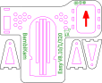

Das SVG [BambiKam_Easy_Aviatik_Sperrholz_2mm_Mavic_ProPlatinum_320.svg](plan/BambiKam_Easy_Aviatik_Sperrholz_2mm_Mavic_ProPlatinum_320.svg) soll folgendermassen gelasert werden:

| Reihenfolge | Farbe   | Geschwindigkeit | Intensität |
| ----------- | ------- | --------------- | ---------- |
| 1           | Grün    | 1000            | 3%         |
| 2           | Pink    | 1000            | 65%        |
| 3           | Schwarz | 1000            | 65%        |
| 4           | Rot     | ignorieren      | ignorieren |

> Bitte beachten, dass die Holzmaserung gemäss dem roten Pfeil ausgerichtet wird.

#### 3D-Druck des Splintens für die Befestigung an der Mavic 1

Das STL für den Druck des Splintens [BambiKam_Easy_Splinten_fuer_Mavic1](plan/BambiKam_Easy_Splinten_fuer_Mavic1.stl) kann mit dem 3D-Drucker ausgedruckt werden.

### DJI Mavic 2 Pro/Zoom mit FLIR Boson 320 50° oder 34°-Kamera

#### Lasern von Aviatik-Sperrholz 2mm für DJI Mavic 2 Pro/Zoom mit FLIR Boson 320 50° oder 34°-Kamera

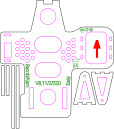

Das SVG [BambiKam_Easy_Aviatik_Sperrholz_2mm_Mavic_2_320.svg](plan/BambiKam_Easy_Aviatik_Sperrholz_2mm_Mavic_2_320.svg) soll folgendermassen gelasert werden:

| Reihenfolge | Farbe   | Geschwindigkeit | Intensität |
| ----------- | ------- | --------------- | ---------- |
| 1           | Grün    | 1000            | 3%         |
| 2           | Pink    | 1000            | 65%        |
| 3           | Schwarz | 1000            | 65%        |
| 4           | Rot     | ignorieren      | ignorieren |

> Bitte beachten, dass die Holzmaserung gemäss dem roten Pfeil ausgerichtet wird.
#### 3D-Druck des Splintens für die Befestigung an der Mavic 2

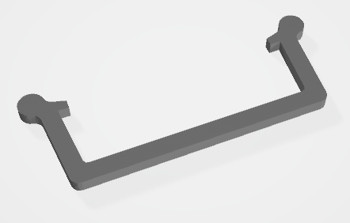

Das STL für den Druck des Splintens [BambiKam_Easy_Splinten_fuer_Mavic2](plan/BambiKam_Easy_Splinten_fuer_Mavic2.stl) kann mit dem 3D-Drucker ausgedruckt werden. Es können gleich zwei Exemplare zur Befestigung verwendet werden.

### DJI Mavic 2 Pro/Zoom mit Thermocam XT384

#### Lasern von Aviatik-Sperrholz 2mm für DJI Mavic 2 Pro/Zoom mit Thermocam XT384

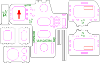

Das SVG [BambiKam_Easy_Aviatik_Sperrholz_2mm_Mavic_2_Thermocam.svg](plan/BambiKam_Easy_Aviatik_Sperrholz_2mm_Mavic_2_Thermocam.svg) soll folgendermassen gelasert werden:

| Reihenfolge | Farbe   | Geschwindigkeit | Intensität |
| ----------- | ------- | --------------- | ---------- |
| 1           | Grün    | 1000            | 3%         |
| 2           | Pink    | 1000            | 65%        |
| 3           | Schwarz | 1000            | 65%        |
| 4           | Rot     | ignorieren      | ignorieren |

> Bitte beachten, dass die Holzmaserung gemäss dem roten Pfeil ausgerichtet wird.

#### 3D-Druck des Splintens für die Befestigung an der Mavic 2

Das STL für den Druck des Splintens [BambiKam_Easy_Splinten_fuer_Mavic2](plan/BambiKam_Easy_Splinten_fuer_Mavic2.stl) kann mit dem 3D-Drucker ausgedruckt werden. Es können gleich zwei Exemplare zur Befestigung verwendet werden.

### Kamerahalterung drucken

#### Kamerahalterung drucken für die FLIR Boson 320 50° oder 34°-Kamera und dem Low Profile BOSON VPC Interface Module

Wichtig: Dieses Gehäuse ist für das Interface "Low Profile BOSON VPC Interface Module":

[https://www.oemcameras.com/rhp-bos-vpc-if.htm](https://www.oemcameras.com/rhp-bos-vpc-if.htm)

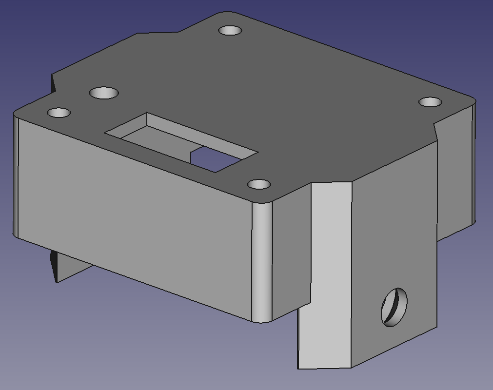

Das STL [BambiKam_Easy_Kameragehaeuse_3D-Druck_FLIR_BOSON_LowIF_320.stl](plan/BambiKam_Easy_Kameragehaeuse_3D-Druck_FLIR_BOSON_LowIF_320.stl) kann mit dem 3D-Drucker ausgedruckt werden.

### Gehäuse für Transmitter drucken

Die BambiKam Easy kann entweder mit dem Eachine TX801, mit dem SpeedyBee VTX-DVR oder TBS Unify Pro 5G8 HV ausgestattet werden.

#### Gehäuse für Eachine TX801

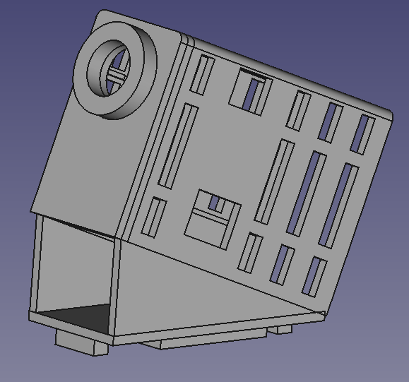

Das STL [BambiKam_Easy_Transmittergehaeuse_Eachine_TX801_3D-Druck](plan/BambiKam_Easy_Transmittergehaeuse_Eachine_TX801_3D-Druck.stl) kann mit dem 3D-Drucker ausgedruckt werden.

#### Gehäuse für SpeedyBee VTX-DVR

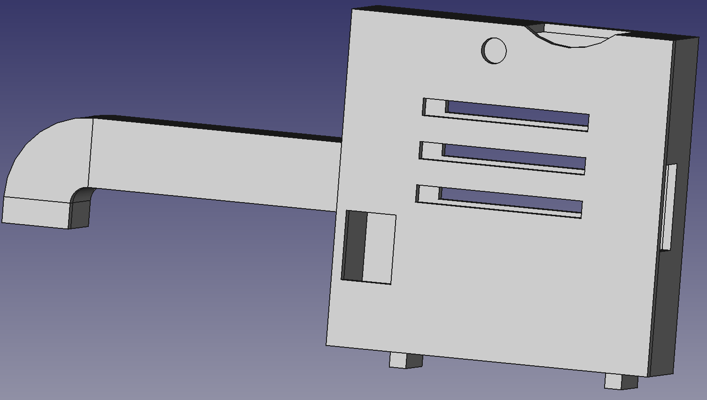

Das STL für den Boden [BambiKam_Easy_Transmittergehaeuse_SpeedyBee_VTX-DVR-Boden-3D-Druck](plan/BambiKam_Easy_Transmittergehaeuse_SpeedyBee_VTX-DVR-Boden-3D-Druck.stl) und jenes für den Deckel [BambiKam_Easy_Transmittergehaeuse_SpeedyBee_VTX-DVR-Deckel-3D-Druck](plan/BambiKam_Easy_Transmittergehaeuse_SpeedyBee_VTX-DVR-Deckel-3D-Druck.stl) kann mit dem 3D-Drucker ausgedruckt werden.

#### Gehäuse für TBS Unify Pro 5G8 HV

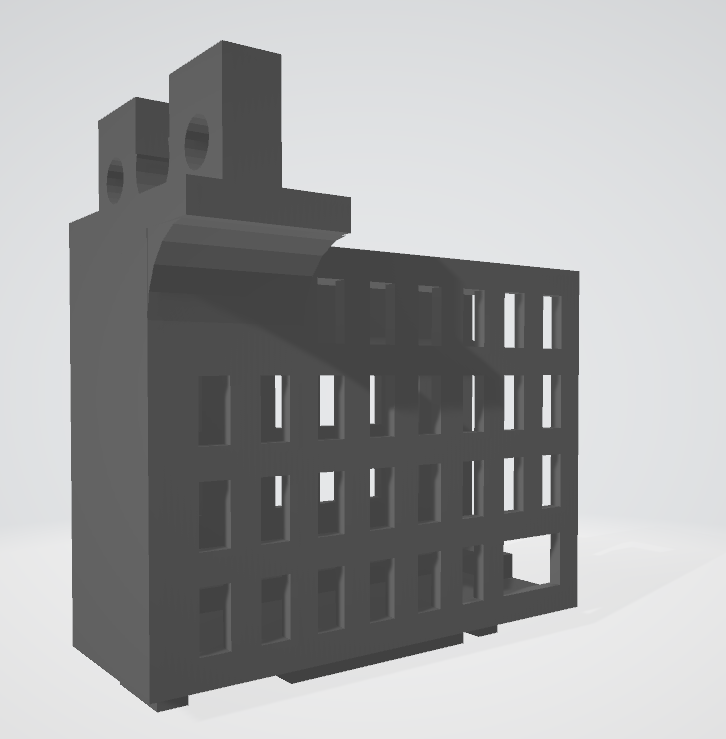

Das STL [BambiKam_Easy_Transmittergehaeuse_TBS_Unify_Pro_5G8_HV_3D-Druck](plan/BambiKam_Easy_Transmittergehaeuse_TBS_Unify_Pro_5G8_HV_3D-Druck.stl) kann mit dem 3D-Drucker ausgedruckt werden.

## Bausatz zusammenbauen

Da die zu leimenden Elemente voneinander abhängen und relativ rasch halten müssen, empfiehlt es sich hier einen holztauglichen Sekundenleim zu verwenden.

Beispielsweise UHU blitzschnell Supergel oder Pattex Ultra Gel. Beide zeichnen sich dadurch aus, dass sie auch outdoortauglich sind und sehr gut halten.

Wichtig ist anschliessend, das verleimte Produkt an der Luft zu trocknen: So verbleiben keine weissen Absonderungen des Sekundenleimes am Holz.

### Abstandhalter auf Grundplatte (Mitte)

Die Abstandhalter stellen einen Abstand zur Drohne her, damit unter dieser die Luft etwas besser zirkulieren kann und zusätzlich die Kabel zwischen der Grundplatte und der Drohne durchgeführt werden können.

Die Orte, wo die Abstandhalter angebracht werden könnten, sind oben in den Bildern ersichtlich.

### Aufhängung für die Kamera (Rechts)

Die Stützen für das Kameragehäuse müssen im exakten Innen-Abstand von 27 mm zueinander eingeklebt werden, damit das Kameragehäuse aus dem 3D-Drucker darin Platz findet. Idealerweise montiert man das Kameragehäuse (ohne die Kamera einzubauen) bereits an die Stützen und hat so den perfekten Abstand.

Das Kameragehäuse wird mit zwei Senkkopfschrauben (M2.5, 6mm Länge) von innen her festgeschraubt. Die Muttern liegen aussen. Um die Kamera zu schonen, sollte diese erst später montiert werden. Die Muttern sollten mit etwas Loctite oder Ähnlichem gesichert werden.

### Lackieren der BambiKam Easy

Um das Holz vor Feuchtigkeit zu schützen, kann die BambiKam Easy noch mit einem schützenden Klarlack lackiert werden. Die allenfalls zuvor schon angebrachten Elemente sollten aber entfernt werden.

### Anbringen des Transmittergehäuses

#### Transmittergehäuse für den Eachine TX801-Transmitter

Das Transmittergehäuse für den TX801-Transmitter wird direkt auf die Grundplatte geklebt. Dabei zeigt das Loch für die Antenne nach vorne.

#### Transmittergehäuse für den SpeedyBee VTX-DVR-Transmitter

Das Transmittergehäuse für den SpeedyBee VTX-DVR-Transmitter wird mit dem Deckel nach aussen aufgeklebt. Die Antenne zeigt auch hier nach vorne.

#### Transmittergehäuse für den TBS Unify Pro 5G8 HV

Das Transmittergehäuse für den TBS Unify Pro 5G8 HV-Transmitter wird direkt auf die Grundplatte geklebt. Dabei zeigt die Aufnahme der Antenne nach vorne.

#### Löten der Verbindungskabel für den TX801-Transmitter

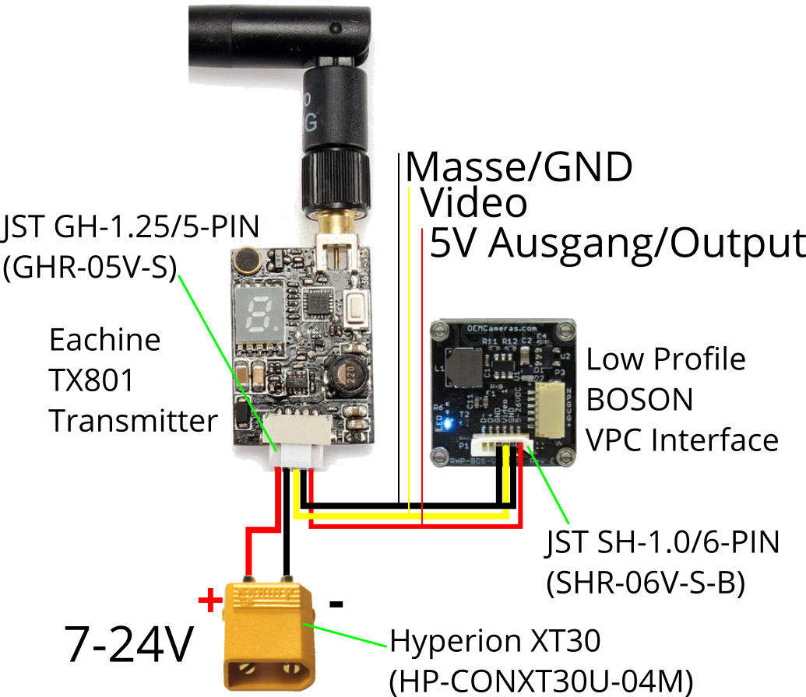

Mit dem TX801-Transmitter wird ein Kabel mit einem JST GH 1.25 5-Pin-Stecker geliefert (links im Bild) und mit dem Interface ein Kabel mit einem JST SH 1.0 6-Pin-Stecker (rechts im Bild). Die beiden Kabel müssen wie im Bild aneinander gelötet werden. Die beiden Stromversorgungskabel (links unten im Bild) müssen womöglich noch etwas verlängert werden damit diese an der Drohne, welche für die Spannungsversorgung bereits vorbereitet wurde, eingesteckt werden können. Im Bild ist ein XT30-Stecker zu sehen.

#### Löten der Verbindungskabel für den SpeedyBee VTX-DVR-Transmitter

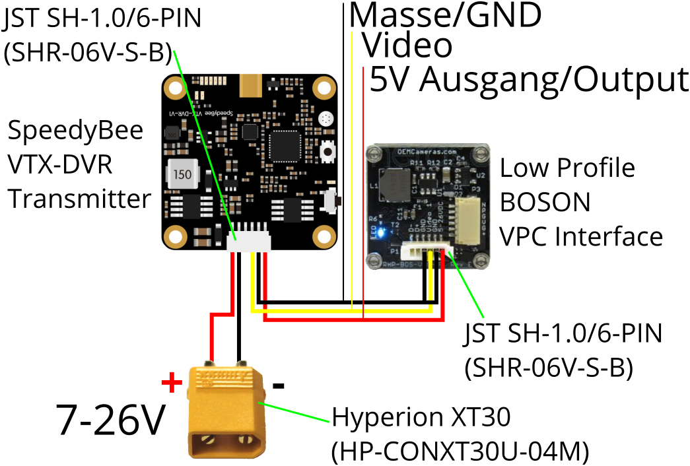

Mit dem SpeedyBee VTX-DVR-Transmitter wird ein Kabel mit einem JST SH 1.0 6-Pin-Stecker geliefert (links im Bild) und mit dem Interface ein Kabel mit (ebenfalls) einem JST SH 1.0 6-Pin-Stecker (rechts im Bild). Die beiden Kabel müssen wie im Bild aneinander gelötet werden. Die beiden Stromversorgungskabel (links unten im Bild) müssen womöglich noch etwas verlängert werden damit diese an der Drohne, welche für die Spannungsversorgung bereits vorbereitet wurde, eingesteckt werden können. Im Bild ist ein XT30-Stecker zu sehen.

#### Löten der Verbindungskabel für den TBS Unify Pro 5G8 HV-Transmitter

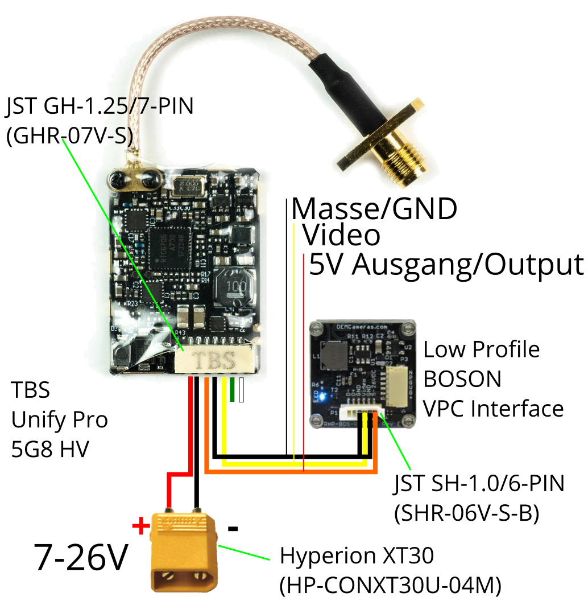

Mit dem TBS Unify Pro 5G8 HV-Transmitter wird ein Kabel mit einem JST GH 1.25 7-Pin-Stecker geliefert und mit dem Interface ein Kabel mit einem JST SH 1.0 6-Pin-Stecker (rechts im Bild). Die beiden Kabel müssen wie im Bild aneinander gelötet werden. Der angebrachte BEC-Stecker am Stromversorgungskabel kann direkt für die Versorgung verwendet werden. Im Bild ist ein XT30-Stecker zu sehen.

### Verlegen der Kabel

Die Kabel können (je nach Länge) nahe des oberen Abstandhalters entlang oder mittig, zwischen die zwei grossen Löcher, gelegt werden und der Einfachheit halber mit zwei kleinen Kabelbindern oder Flüssiggummi befestigt werden.

### Sender und Antenne montieren

>Es ist wichtig, dass die Antenne während des Betriebes nicht abfallen kann. Wird der Sender ohne Antenne betrieben, kann dieser beschädigt werden.

Der Sender wird in das Gehäuse eingeschoben, wobei darauf geachtet werden muss, dass die quadratische Fläche um das Antennengewinde plan mit dem Gehäuse ist. Die Antenne soll dabei nach vorne zeigen. Die Antenne muss anschliessend mit einem Schraubenschlüssel gut angezogen werden. Wichtig ist, dass sich die Antenne nicht mehr selbständig in der Fassung drehen kann.

## Montage der Kamera (Endmontage)

### Kamera montieren

Bevor die Kamera montiert werden kann, muss das Interface auf die Kamera aufgesteckt werden. Der Stecker ist nicht leichtgängig und es kann helfen, wenn man das Interface vorsichtig mit den kurzen Schrauben an der Kamera festschraubt.

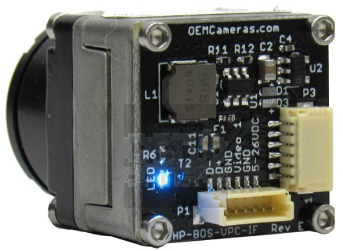

Wenn kein Spalt mehr zwischen Interface und Kamera vorhanden ist, können die Schrauben wieder gelöst werden und die Kamera mit Interface in das Gehäuse auf der rechten Seite eingeschoben werden. Dabei ist darauf zu achten, dass die Ausrichtung des nach oben zeigenden Steckers des Interfaces korrekt ist.

Die Befestigung erfolgt mit den langen Schrauben, welche mit dem Interface mitgeliefert wurden.

Der Stecker des Kabels muss anschliessend noch auf dem Interface aufgesteckt werden.

## Anbringen der Grundplatte an den Kopter

Am besten legt man die Mavic auf den Rücken und legt die Grundplatte mit der Kamera nach unten zeigend so auf die Landekufen, dass sie durch die vertikalen Aussparungen zeigen. Die Befestigung der Grundplatte erfolgt durch das Einschieben des Splintens mit der Aussparung. Wichtig ist, dass der Splinten von links eingeschoben wird, da so die Kamera nicht verdeckt wird.

## Fliegen

Das Flugverhalten der Mavic wird durch das Mitführen der BambiKam Easy nicht merklich verändert. Der Start verläuft balanciert, da sich die Komponenten im Schwerpunkt befinden.

Durch das geringe Gewicht der BambiKam Easy wird auch die Flugzeit nicht allzu negativ beeinflusst.

## Wichtige/wissenswerte Punkte

- Der Sender darf *nie* ohne Antenne mit Strom versorgt werden, da sonst der Sender zerstört wird.
- Das an der Stromversorgung angehängte Kabel führt nur Strom, wenn die Drohne eingeschaltet ist. Ein Ein-/Aus-Schalter ist nicht nötig.
- Die Kunststoffteile sind aus PLA gefertigt. Bitte lassen Sie diese nicht im heissen Auto liegen, da es sonst allenfalls zu Verformungen kommen könnte.
- Es kann in seltenen Fällen vorkommen, dass sich die Ultraschallsensoren (Downward Vision Sensors) nicht mit der Aufhängung verstehen. Dies äussert sich so, dass die Mavic eigenständig aufsteigt. Dem muss durch beharrliches Gegensteuern (linker Steuerknüppel nach unten ziehen) begegnet werden. Falls das Problem nicht gelöst werden kann, so können die "Downward Vision Sensors" abgeschaltet werden. Dies bedeutet, man muss bei der Landung vorsichtiger sein, da man keine Unterstützung durch die Sensoren hat. Dies ist aber eigentlich nicht die Idee.

## Testflug mit der BambiKam V6

|                     |                                                                                                |
| ------------------- | ---------------------------------------------------------------------------------------------- |
| Datum:              | 19.08.2018 10:15                                                                               |
| Wetter:             | Wolkenloser Himmel, 22°C, Wind 5 km/h                                                          |
| Testszenario:       | Wiederholter Wegpunktflug des folgenden Tracks: <https://flylitchi.com/hub?m=hBNMMruee6#>      |
| Zeitmessung:        | Ab Start des 1. Missionsdurchganges (ein Meter ab Boden) bis zum Ertönen des Akku-Alarms (30%) |
| __Erreichte Zeit:__ | __17 Minuten 2 Sekunden__ (Vorwärtsflug)                                                       |
