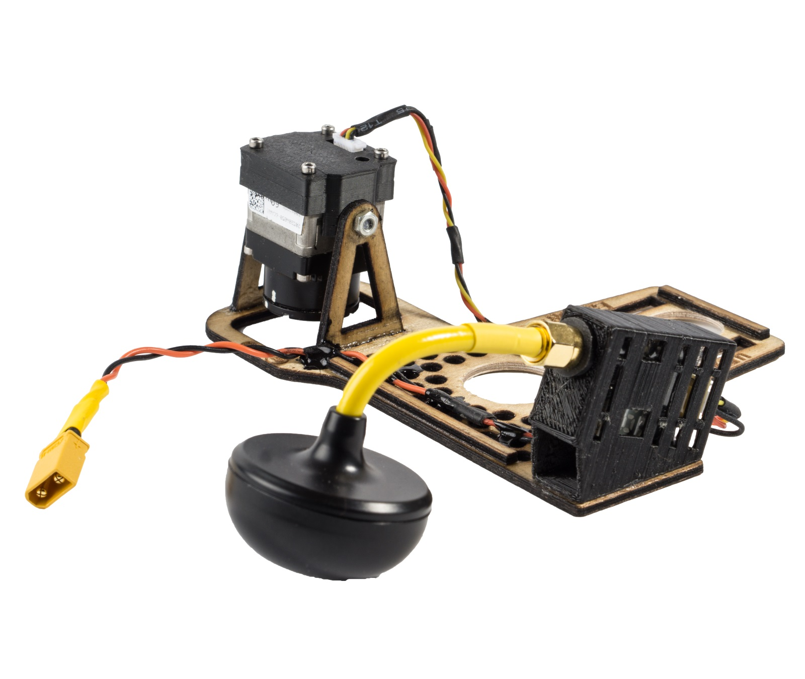
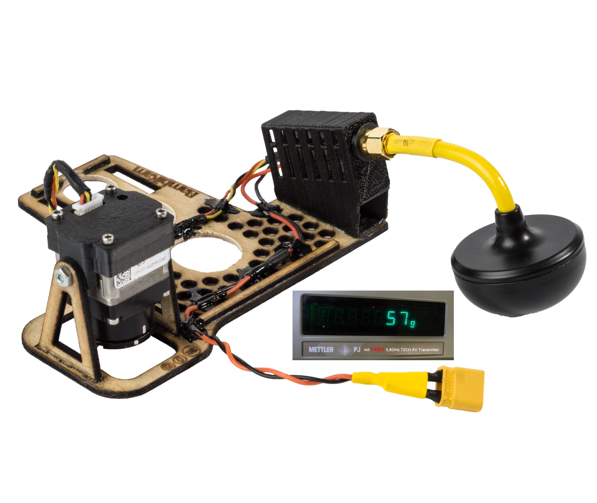

# BambiKam Easy V8 22.9.2018 [BETA]

> Die BambiKam V8 ist noch im BETA-Stadium. Deswegen ist noch nicht alles auf dem aktuellsten Stand.

> Wo möchten Sie einsteigen?
> - [Kleben der einzelnen Elemente (Bausatz zusammenbauen)](#kleben-der-einzelnen-elemente-bausatz-zusammenbauen)
> - [Montage der Elemente auf der Grundplatte (Endmontage)](#montage-der-elemente-auf-der-grundplatte-endmontage)

- [Was ist BambiKam?](#was-ist-bambikam)
- [Warum wurde BambiKam Easy entworfen?](#warum-wurde-bambikam-easy-entworfen)
- [Zeig her die Bilder! Ich will sehen wie's aussieht!](#zeig-her-die-bilder-ich-will-sehen-wies-aussieht)
- [Was zeichnet BambiKam Easy aus?](#was-zeichnet-bambikam-easy-aus)
- [Müssen an der Drohne Modifikationen vorgenommen werden?](#m%C3%BCssen-an-der-drohne-modifikationen-vorgenommen-werden)
- [Kann die BambiKam auch an die Mavic 2 befestigt werden?](#kann-die-bambikam-auch-an-die-mavic-2-befestigt-werden)
- [Lizenz](#lizenz)
- [Materialien](#materialien)
    - [Aviatik-Sperrholz 2mm](#aviatik-sperrholz-2mm)
    - [3D-Druck](#3d-druck)
- [Anfertigen der BambiKam Easy](#anfertigen-der-bambikam-easy)
    - [Lasern von Aviatik-Sperrholz 2mm](#lasern-von-aviatik-sperrholz-2mm)
    - [Kamerahalterung drucken](#kamerahalterung-drucken)
    - [Gehäuse für Transmitter drucken](#geh%C3%A4use-f%C3%BCr-transmitter-drucken)
- [Kleben der einzelnen Elemente (Bausatz zusammenbauen)](#kleben-der-einzelnen-elemente-bausatz-zusammenbauen)
    - [Abstandhalter auf Grundplatte (Mitte)](#abstandhalter-auf-grundplatte-mitte)
    - [Aufhängung für die Kamera (Rechts)](#aufh%C3%A4ngung-f%C3%BCr-die-kamera-rechts)
    - [Lackieren der BambiKam Easy](#lackieren-der-bambikam-easy)
    - [Anbringen des Transmittergehäuses](#anbringen-des-transmittergeh%C3%A4uses)
        - [Transmittergehäuse für den Eachine TX801-Transmitter](#transmittergeh%C3%A4use-f%C3%BCr-den-eachine-tx801-transmitter)
        - [Transmittergehäuse für den SpeedyBee VTX-DVR-Transmitter](#transmittergeh%C3%A4use-f%C3%BCr-den-speedybee-vtx-dvr-transmitter)
        - [Löten der Verbindungskabel für den TX801-Transmitter](#l%C3%B6ten-der-verbindungskabel-f%C3%BCr-den-tx801-transmitter)
        - [Löten der Verbindungskabel für den SpeedyBee VTX-DVR-Transmitter](#l%C3%B6ten-der-verbindungskabel-f%C3%BCr-den-speedybee-vtx-dvr-transmitter)
- [Montage der Elemente auf der Grundplatte (Endmontage)](#montage-der-elemente-auf-der-grundplatte-endmontage)
    - [Kamera montieren](#kamera-montieren)
    - [Verlegen der Kabel](#verlegen-der-kabel)
    - [Sender und Antenne montieren](#sender-und-antenne-montieren)
- [Anbringen der Grundplatte an den Kopter](#anbringen-der-grundplatte-an-den-kopter)
- [Fliegen](#fliegen)
- [Wichtige/wissenswerte Punkte](#wichtigewissenswerte-punkte)
- [Testflug mit der BambiKam V6](#testflug-mit-der-bambikam-v6)

## Was ist BambiKam?

BambiKam ist eine Plattform, welche es erlaubt eine [FLIR BOSON](http://www.flir.de/cores/boson/) Wärmebildkamera zusammen mit einem [Eachine TX801-Sender](https://www.google.com/search?q=eachine%20tx801) und einer [Cloverleaf](https://www.google.com/search?q=align+cloverleaf+5.8+ghz)-Antenne an eine [DJI Mavic Pro/Platinum](https://www.google.com/search?q=dji+mavic+pro+platinum) zu befestigen.

Wahlweise ist es auch möglich, einen [SpeedyBee VTX-DVR](https://www.speedybee.com/speedy-bee-vtx-dvr/)-Transmitter zu verwenden. Dieser erlaubt es, das Videosignal direkt auf eine MicroSD-Karte aufzuzeichnen. Dazu muss das alternative Gehäuse verwendet werden. Die Grundplatte ist identisch.

## Warum wurde BambiKam Easy entworfen?

BambiKam Easy wurde für die Rehkitzsuche (siehe auch [Rehkitzrettung Schweiz](https://www.rehkitzrettung.ch/)) entworfen. Damit die Mavic mit dem Velo transportiert werden könnte, ist es wichtig, dass sie nicht mehr Platz braucht als wirklich nötig. Die Mavic kann so im nicht gefalteten Zustand in einen Koffer verstaut werden.

## Zeig her die Bilder! Ich will sehen wie's aussieht!

## Was zeichnet BambiKam Easy aus?

- Inklusive Kamera, Sender und Antenne beträgt das Gewicht weniger als 65 Gramm. 
- Durch das Anbringen der Kamera, Sender und Antenne auf der Seite kann auf Verlängerungen verzichtet werden. Dies spart ebenfalls Gewicht und macht die Drohne nicht höher.
- Durch die einfache Befestigung der Grundplatte an den hinteren Landekufen der Mavic ist es ganz einfach, die BambiKam Easy zu entfernen und diese so als ganz normale Drohne zu verwenden.
- Die Grundplatte hat Löcher, welche die Sensoren der Mavic nicht beeinträchtigen. So ist es möglich, auch nach dem Anbringen der BambiKam Easy, die Mavic mit Hilfe der Sensoren zu landen.

## Müssen an der Drohne Modifikationen vorgenommen werden?

Durch die Tatsache, dass eine eigene Stromversorgung wiederum Gewicht bedeutet und schon eine Stromversorgung der Drohne vorhanden ist, welche verwendet werden kann, um den Sender und die Kamera mit Strom zu versorgen, ist es eine Überlegung wert, die Stromversorgung des Quadcopters anzuzapfen. Selbstverständlich muss man sich der Tatsache bewusst sein, dass dies Auswirkung auf die Herstellergarantie haben kann.

Der Stromverbrauch des Senders und der Kamera ist sehr klein und beeinflusst die Flugzeit minimal.

Die BambiKam Easy sieht keine Halterung für einen separaten Akku vor.

## Kann die BambiKam auch an die Mavic 2 befestigt werden?

Nein, derzeit gibt es noch keine BambiKam, welche die Mavic 2 unterstützt. Die Landekufen der Mavic 2 wurden neu gestaltet und es muss erst wieder eine Lösung gefunden werden.

## Lizenz

BambiKam Easy steht unter der Lizenz [CC BY SA](https://creativecommons.org/licenses/by-sa/3.0/ch/) und darf somit beliebig kopiert, verändert und geteilt werden unter der Bedingung, dass diese Änderungen wiederum geteilt werden und ein Hinweis auf das Ursprungsprojekt gegeben wird.

Es wird keine Verantwortung übernommen.

## Materialien

### Aviatik-Sperrholz 2mm

Der Hauptteil besteht aus Aviatik Sperrholz, 2mm. Dieses erhält man bei Coop Bau&Hobby.
Das Aviatik Sperrholz hat den Vorteil, dass es dünn, sehr stabil und vielschichtig verleimt ist.

### 3D-Druck

Die Kamerahalterung und das Gehäuse für den Transmitter werden im 3D-Druckverfahren hergestellt.

## Anfertigen der BambiKam Easy

Ist das Holz beschafft, so lässt sich die Form sehr einfach mit einem LaserCutter schneiden.
Beispielsweise verfügen diverse Fablabs in der Schweiz über einen Lasercutter [Fablabs der Schweiz](https://fablab.ch/#/machine).
So auch das [FablabWinti](https://www.fablabwinti.ch/das-lab/ausstattung/lasercutter/). (Neue Mitglieder sind immer herzlich willkommen!)

### Lasern von Aviatik-Sperrholz 2mm

Das SVG [BambiKam_Easy_Aviatik_Sperrholz_2mm.svg](plan/BambiKam_Easy_Aviatik_Sperrholz_2mm.svg) soll folgendermassen gelasert werden:

| Reihenfolge | Farbe    | Geschwindigkeit | Intensität |
| ----------- | -------- | --------------- | ---------- |
| 1           | Gelb     | 1000            | 3%         |
| 2           | Pink     | 1000            | 70%        |
| 3           | Schwarz  | 1000            | 70%        |
| 4           | Rot      | ignorieren      | ignorieren |

> Bitte beachten, dass die Holzmaserung gemäss dem roten Pfeil ausgerichtet wird.

### Kamerahalterung drucken

Das STL [BambiKam_Easy_Kameragehaeuse_3D-Druck.stl](plan/BambiKam_Easy_Kameragehaeuse_3D-Druck.stl) kann mit dem 3D-Drucker ausgedruckt werden.

### Gehäuse für Transmitter drucken

Das STL [BambiKamEasy__Transmittergehaeuse.stl](plan/BambiKam_Easy_Transmittergehaeuse_3D-Druck.stl) kann mit dem 3D-Drucker ausgedruckt werden.

## Kleben der einzelnen Elemente (Bausatz zusammenbauen)

Da die zu leimenden Elemente voneinander abhängen und relativ rasch halten müssen, empfiehlt es sich hier einen holztauglichen Sekundenleim zu verwenden.

Beispielsweise UHU blitzschnell Supergel oder Pattex Ultra Gel. Beide zeichnen sich dadurch aus, dass sie auch outdoortauglich sind und sehr gut halten.

Wichtig ist anschliessend, das verleimte Produkt an der Luft zu trocknen: So verbleiben keine weissen Absonderungen des Sekundenleimes am Holz.

### Abstandhalter auf Grundplatte (Mitte)

Die Abstandhalter stellen einen Abstand zur Drohne her, damit unter dieser die Luft etwas besser zirkulieren kann und zusätzlich die Kabel zwischen der Grundplatte und der Drohne durchgeführt werden können.

Die Orte, wo die Abstandhalter angebracht werden könnten, sind oben in den Bildern ersichtlich.

### Aufhängung für die Kamera (Rechts)

Die Stützen für das Kameragehäuse müssen im exakten Innen-Abstand von 27 mm zueinander eingeklebt werden, damit das Kameragehäuse aus dem 3D-Drucker darin Platz findet. Idealerweise montiert man das Kameragehäuse (ohne die Kamera einzubauen) bereits an die Stützen und hat so den perfekten Abstand.

Das Kameragehäuse wird mit zwei Senkkopfschrauben (M2.5, 6mm Länge) von innen her festgeschraubt. Die Muttern liegen aussen. Um die Kamera zu schonen, sollte diese erst später montiert werden.

### Lackieren der BambiKam Easy

Um das Holz vor Feuchtigkeit zu schützen, kann die BambiKam Easy noch mit einem schützenden Klarlack lackiert werden. Die allenfalls zuvor schon angebrachten Elemente sollten aber entfernt werden.

### Anbringen des Transmittergehäuses

#### Transmittergehäuse für den Eachine TX801-Transmitter

Das Transmittergehäuse für den TX801-Transmitter wird direkt auf die Grundplatte geklebt. Dabei zeigt das Loch für die Antenne nach vorne.

#### Transmittergehäuse für den SpeedyBee VTX-DVR-Transmitter

Das Transmittergehäuse für den SpeedyBee VTX-DVR-Transmitter wird mit dem Deckel nach aussen aufgeklebt. Die Antenne zeigt auch hier nach vorne.

#### Löten der Verbindungskabel für den TX801-Transmitter

Mit dem TX801-Transmitter wird ein Kabel mit einem JST GH 1.25 5-Pin-Stecker geliefert (links im Bild) und mit dem Interface ein Kabel mit einem JST SH 1.0 6-Pin-Stecker (rechts im Bild). Die beiden Kabel müssen wie im Bild aneinander gelötet werden. Die beiden Stromversorgungskabel (links unten im Bild) müssen womöglich noch etwas verlängert werden damit diese an der Drohne, welche für die Spannungsversorgung bereits vorbereitet wurde, eingesteckt werden können. Im Bild ist eine XT30-Buchse zu sehen.

#### Löten der Verbindungskabel für den SpeedyBee VTX-DVR-Transmitter

Mit dem SpeedyBee VTX-DVR-Transmitter wird ein Kabel mit einem JST SH 1.0 6-Pin-Stecker geliefert (links im Bild) und mit dem Interface ein Kabel mit (ebenfalls) einem JST SH 1.0 6-Pin-Stecker (rechts im Bild). Die beiden Kabel müssen wie im Bild aneinander gelötet werden. Die beiden Stromversorgungskabel (links unten im Bild) müssen womöglich noch etwas verlängert werden damit diese an der Drohne, welche für die Spannungsversorgung bereits vorbereitet wurde, eingesteckt werden können. Im Bild ist eine XT30-Buchse zu sehen.

## Montage der Elemente auf der Grundplatte (Endmontage)

### Kamera montieren

Die Kamera kann erst nach der Montage der Kamerahalterung montiert werden. Die Kamera wird mittels den langen Schrauben, die mit dem Interface mitgeliefert werden, festgeschraubt.

### Verlegen der Kabel

Die Kabel können (je nach Länge) nahe des oberen Abstandhalters entlang oder mittig, zwischen die zwei grossen Löcher, gelegt werden und der Einfachheit halber mit zwei kleinen Kabelbindern befestigt werden.

### Sender und Antenne montieren

>Es ist wichtig, dass die Antenne während des Betriebes nicht abfallen kann. Wird der Sender ohne Antenne betrieben, kann dieser beschädigt werden.

Der Sender wird in das Gehäuse eingeschoben, wobei darauf geachtet werden muss, dass die quadratische Fläche um das Antennengewinde plan mit dem Gehäuse ist. Die Antenne soll dabei nach vorne zeigen.

## Anbringen der Grundplatte an den Kopter

Am besten legt man die Mavic auf den Rücken und legt die Grundplatte mit der Kamera nach unten zeigend so auf die Landekufen, dass sie durch die vertikalen Aussparungen zeigen. Die Befestigung der Grundplatte erfolgt durch das Einschieben des Splintens mit der Aussparung. Wichtig ist, dass der Splinten von links eingeschoben wird, da so die Kamera nicht verdeckt wird.

## Fliegen

Das Flugverhalten der Mavic wird durch das Mitführen der BambiKam Easy nicht merklich verändert. Der Start verläuft balanciert, da sich die Komponenten im Schwerpunkt befinden.

Durch das geringe Gewicht der BambiKam Easy wird auch die Flugzeit nicht allzu negativ beeinflusst.

## Wichtige/wissenswerte Punkte

- Der Sender darf *nie* ohne Antenne mit Strom versorgt werden, da sonst der Sender zerstört wird.
- Das an der Stromversorgung angehängte Kabel führt nur Strom, wenn die Drohne eingeschaltet ist. Ein Ein-/Aus-Schalter ist nicht nötig.
- Die Kunststoffteile sind aus PLA gefertigt. Bitte lassen Sie diese nicht im heissen Auto liegen, da es sonst allenfalls zu Verformungen kommen könnte.
- Die FLIR Boson 640 50° (8.7 mm) eignet sich auf Grund der Objektivgrösse nicht für die BambiKam Easy.

## Testflug mit der BambiKam V6

|                     |                                                                                                |
| ------------------- | ---------------------------------------------------------------------------------------------- |
| Datum:              | 19.08.2018 10:15                                                                               |
| Wetter:             | Wolkenloser Himmel, 22°C, Wind 5 km/h                                                          |
| Testszenario:       | Wiederholter Wegpunktflug des folgenden Tracks: <https://flylitchi.com/hub?m=hBNMMruee6#>      |
| Zeitmessung:        | Ab Start des 1. Missionsdurchganges (ein Meter ab Boden) bis zum Ertönen des Akku-Alarms (30%) |
| __Erreichte Zeit:__ | __17 Minuten 2 Sekunden__ (Vorwärtsflug)                                                       |