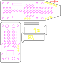

# BambiKam Pro V2 (BETA) 9.8.2018

> Wichtig: V2 ist derzeit noch im BETA-Stadium. Deshalb ist hier auch nocht fast nichts aktuell.

> Wo möchten Sie einsteigen?
> - [Kleben der einzelnen Elemente](#kleben-der-einzelnen-elemente)

- [Was ist BambiKam?](#was-ist-bambikam)
- [Zeig her die Bilder! Ich will sehen wie's aussieht!](#zeig-her-die-bilder-ich-will-sehen-wies-aussieht)
- [Was zeichnet BambiKam Pro aus?](#was-zeichnet-bambikam-pro-aus)
- [Müssen an der Drohne Modifikationen vorgenommen werden?](#m%C3%BCssen-an-der-drohne-modifikationen-vorgenommen-werden)
- [Lizenz](#lizenz)
- [Materialien](#materialien)
    - [Aviatik-Sperrholz 2mm](#aviatik-sperrholz-2mm)
    - [3D-Druck](#3d-druck)
- [Anfertigen der BambiKam Pro](#anfertigen-der-bambikam-pro)
    - [Lasern von Aviatik-Sperrholz 2mm](#lasern-von-aviatik-sperrholz-2mm)
    - [Lüfterzähne drucken](#l%C3%BCfterz%C3%A4hne-drucken)
   - [Kleben der einzelnen Elemente](#kleben-der-einzelnen-elemente)
        - [Abstandhalter auf der langen Grundplatte](#abstandhalter-auf-der-langen-grundplatte)
    - [Lackieren der BambiKam Pro](#lackieren-der-bambikam-pro)
        - [Lüfterzähne an die lange Grundplatte](#l%C3%BCfterz%C3%A4hne-an-die-lange-grundplatte)
- [Montage](#montage)
    - [Anbringen der unteren Platte](#anbringen-der-unteren-platte)
    - [Verlegen der Kabel](#verlegen-der-kabel)
    - [Sender und Antenne montieren](#sender-und-antenne-montieren)
    - [Montage der Kamera](#montage-der-kamera)
- [Konfiguration](#konfiguration)
    - [Programmieren des Gimbals](#programmieren-des-gimbals)
- [Anbringen der Grundplatte an den Kopter](#anbringen-der-grundplatte-an-den-kopter)
- [Fliegen](#fliegen)
- [Wichtige/wissenswerte Punkte](#wichtigewissenswerte-punkte)

## Was ist BambiKam?

BambiKam ist eine Plattform, welche es erlaubt eine [FLIR BOSON](http://www.flir.de/cores/boson/) Wärmebildkamera zusammen mit einem [Eachine TX801-Sender](https://www.google.com/search?q=eachine%20tx801) und einer [Cloverleaf](https://www.google.com/search?q=align+cloverleaf+5.8+ghz)-Antenne an eine [DJI Mavic Pro/Platinum](https://www.google.com/search?q=dji+mavic+pro+platinum) zu befestigen.

## Zeig her die Bilder! Ich will sehen wie's aussieht!

## Was zeichnet BambiKam Pro aus?

- Inklusive Kamera, Sender und Antenne beträgt das Gewicht ca. 120 Gramm. 
- Jederzeit perfekt ausbalancierte, senkrecht ausgerichtete Kameraeinstellung
- ...

## Müssen an der Drohne Modifikationen vorgenommen werden?

Durch die Tatsache, dass eine eigene Stromversorgung wiederum Gewicht bedeutet und schon eine Stromversorgung der Drohne vorhanden ist, welche verwendet werden kann, um den Sender und die Kamera mit Strom zu versorgen, ist es eine Überlegung wert, die Stromversorgung des Quadcopters anzuzapfen. Selbstverständlich muss man sich der Tatsache bewusst sein, dass dies Auswirkung auf die Herstellergarantie haben kann.

Der Stromverbrauch des Senders und der Kamera ist sehr klein und beeinflusst die Flugzeit minimal.

Die BambiKam Pro könnte einen kleinen Akku aufnehmen, wenn der Sender woanders platziert wird.

## Lizenz

BambiKam Pro steht unter der Lizenz [CC BY SA](https://creativecommons.org/licenses/by-sa/3.0/ch/) und darf somit beliebig kopiert, verändert und geteilt werden unter der Bedingung, dass diese Änderungen wiederum geteilt werden und ein Hinweis auf das Ursprungsprojekt gegeben wird.

Es wird keine Verantwortung übernommen.

## Materialien

### Aviatik-Sperrholz 2mm

Der Hauptteil besteht aus Aviatik Sperrholz, 2mm. Dieses erhält man bei Coop Bau&Hobby.
Das Aviatik Sperrholz hat den Vorteil, dass es dünn, sehr stabil und vielschichtig verleimt ist.

### 3D-Druck

Die Lüfterzähne für die Stabilitätserhöhung werden im 3D-Druckverfahren hergestellt.

## Anfertigen der BambiKam Pro

Ist das Holz beschafft, so lässt sich die Form sehr einfach mit einem LaserCutter schneiden.
Beispielsweise verfügen diverse Fablabs in der Schweiz über einen Lasercutter [Fablabs der Schweiz](https://fablab.ch/#/machine).
So auch das [FablabWinti](https://www.fablabwinti.ch/das-lab/ausstattung/lasercutter/). (Neue Mitglieder sind immer herzlich willkommen!)

### Lasern von Aviatik-Sperrholz 2mm

Das SVG [BambiKam_Pro_Aviatik_Sperrholz_2mm.svg](plan/BambiKam_Pro_Aviatik_Sperrholz_2mm.svg) soll folgendermassen gelasert werden:

| Reihenfolge | Farbe    | Geschwindigkeit | Intensität |
| ----------- | -------- | --------------- | ---------- |
| 1           | Gelb     | 1000            | 3%         |
| 2           | Pink     | 1000            | 70%        |
| 3           | Schwarz  | 1000            | 70%        |
| 4           | Rot      | ignorieren      | ignorieren |

> Bitte beachten, dass die Holzmaserung gemäss dem roten Pfeil ausgerichtet wird.

### Lüfterzähne drucken

Das STL [BambiKam_Pro_Luefterzaehne_3D-Druck.stl](plan/BambiKam_Pro_Luefterzaehne_3D-Druck.stl) kann mit dem 3D-Drucker ausgedruckt werden.

TODO: Braucht es da spezielle Einstellungen?

### Kleben der einzelnen Elemente

Um die einzelnen Elemente zu kleben, wird ein Sekundenleim empfohlen.

Beispielsweise UHU blitzschnell Supergel oder Pattex Ultra Gel. Beide zeichnen sich dadurch aus, dass sie auch outdoortauglich sind und sehr gut halten.

Wichtig ist anschliessend, das verleimte Produkt an der Luft zu trocknen: So verbleiben keine weissen Absonderungen des Sekundenleimes am Holz.

#### Abstandhalter auf der langen Grundplatte

Der Abstandhalter stellt einen Abstand zur Drohne her, damit unter dieser die Luft etwas besser zirkulieren kann.

Der Abstandhalter sollte gleich hinter den vertikalen Landekufen-Aussparungen angebracht werden. Die exakte Position ist im Bild ganz oben ersichtlich.

### Lackieren der BambiKam Pro

Um das Holz vor Feuchtigkeit zu schützen, kann die BambiKam Pro noch mit einem schützenden Klarlack lackiert werden. Die allenfalls zuvor schon angebrachten Elemente sollten aber entfernt werden.

#### Lüfterzähne an die lange Grundplatte

Die Lüfterzähne müssen ebenfalls nach oben zeigen und ganz vorne mittig an der Grundplatte festgeklebt werden.

## Montage

### Anbringen der unteren Platte

...
- Gimbalsteuerung auf kleine Grundplatte schrauben.
- Mittels Abstandhalter verbinden mit Grundplatte verbinden.

### Verlegen der Kabel

...

### Sender und Antenne montieren

>Es ist wichtig, dass die Antenne während des Betriebes nicht abfallen kann. Wird der Sender ohne Antenne betrieben, kann dieser beschädigt werden.

...

### Montage der Kamera

...

## Konfiguration

### Programmieren des Gimbals

1. Aufrufen der Seite https://www.basecamelectronics.com/downloads/8bit/
2. Version 2.2b2 mit Hex File Downloaden
3. Aus der Sektion 2.2b2 die folgenden Dateien herunterladen:
- Die Firmware-Datei SimpleBGC_2_2b2.enc.hex
- Das GUI SimpleBGC_GUI_2_2b2.zip 
4. Das GUI installieren.
5. Den Gimbal-Controller über USB-Kabel mit dem Computer verbinden.
6. Starten des GUIs.
7. Die Einstellungen gemäss folgenden Screenshots vornehmen:

8. Kamera 90° manuell nach unten richten.
9. Anschliessend nacheinander "ACC KALIB“ "CALIB GYRO“ und „SCHREIBEN“ anwählen.

## Anbringen der Grundplatte an den Kopter

Am besten legt man die Mavic auf den Rücken und legt die Grundplatte so auf die Landekufen, dass sie durch die vertikalen Aussparungen zeigen. Die Befestigung der Grundplatte erfolgt durch das Einschieben des Splintens.

## Fliegen

Das Flugverhalten der Mavic wird durch das Mitführen der BambiKam Pro nicht gross verändert. Der Start verläuft balanciert, da sich die Komponenten im Schwerpunkt befinden.

## Wichtige/wissenswerte Punkte

- Der Sender darf *nie* ohne Antenne mit Strom versorgt werden, da sonst der Sender zerstört wird.
- Das an der Stromversorgung angehängte Kabel führt nur Strom, wenn die Drohne eingeschaltet ist. Ein Ein-/Aus-Schalter ist nicht nötig.
