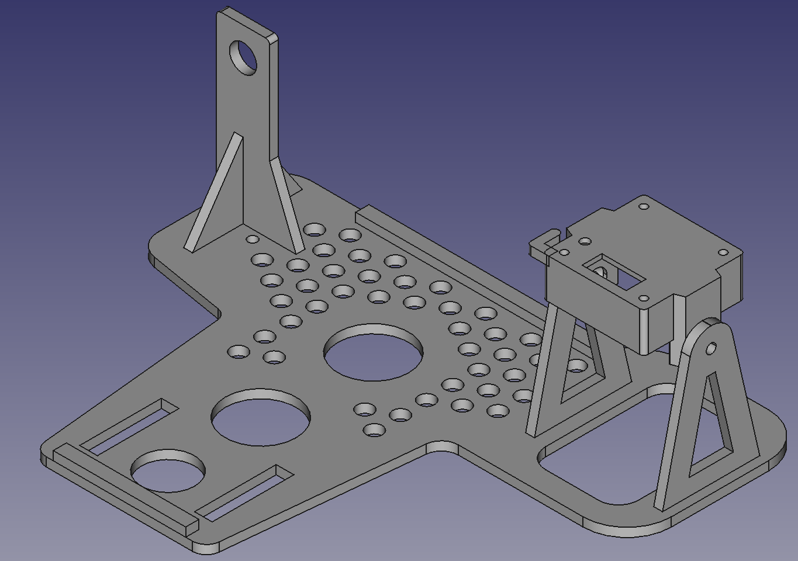
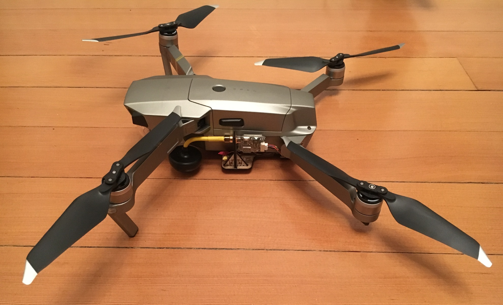
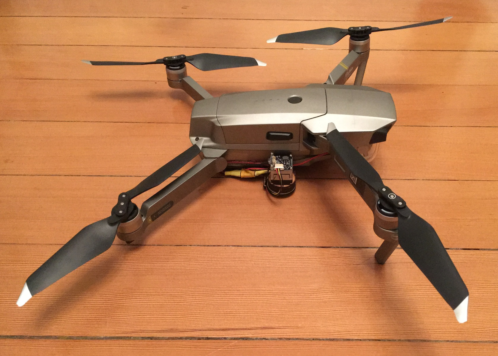
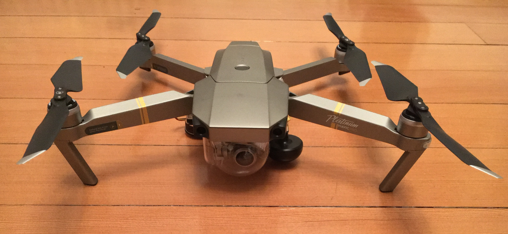
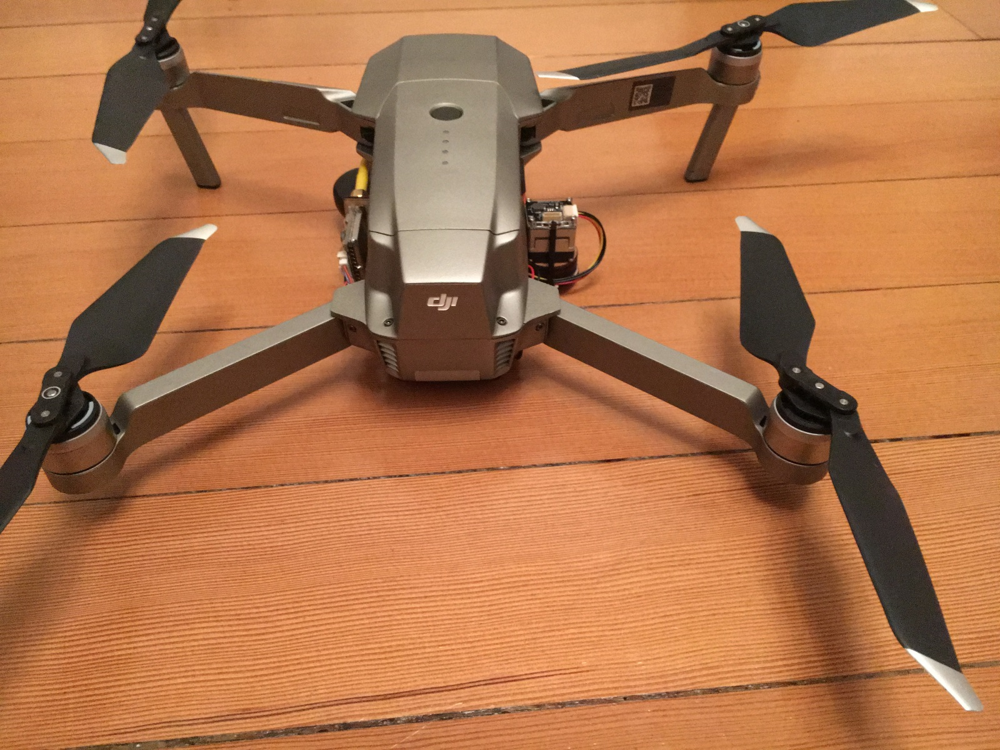
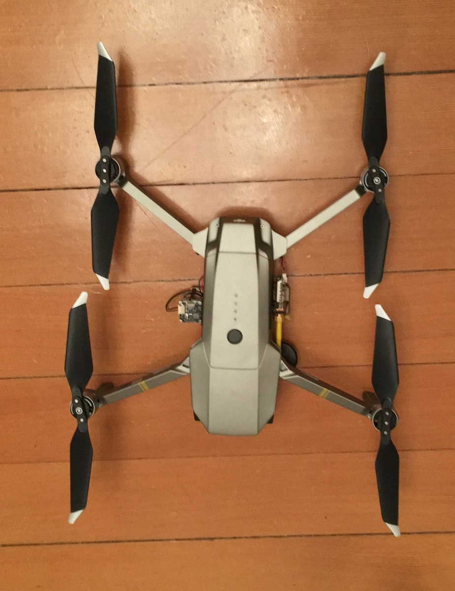
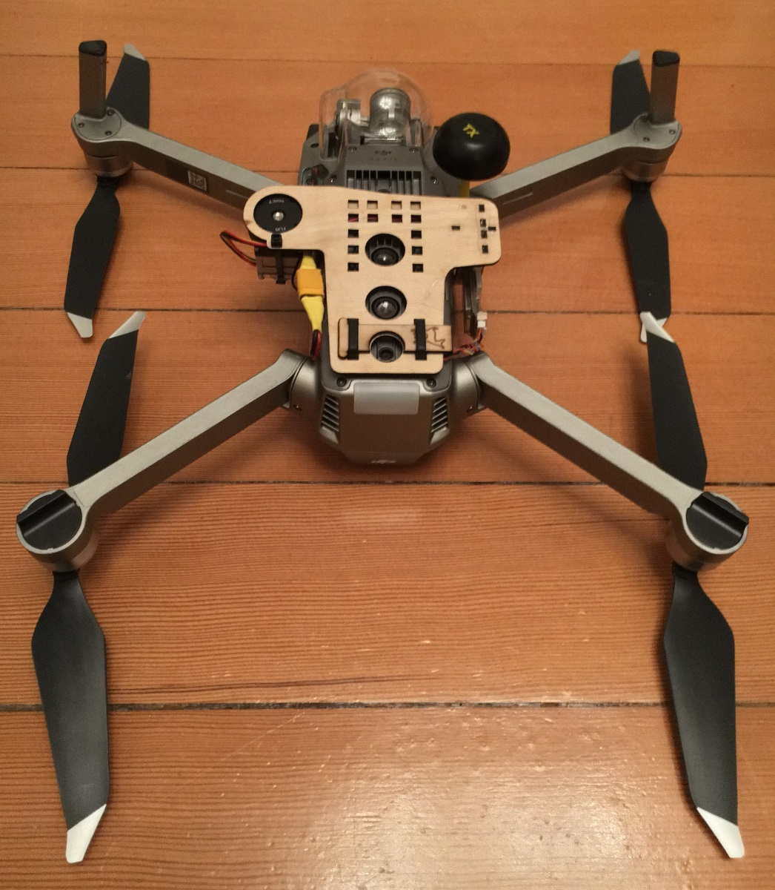
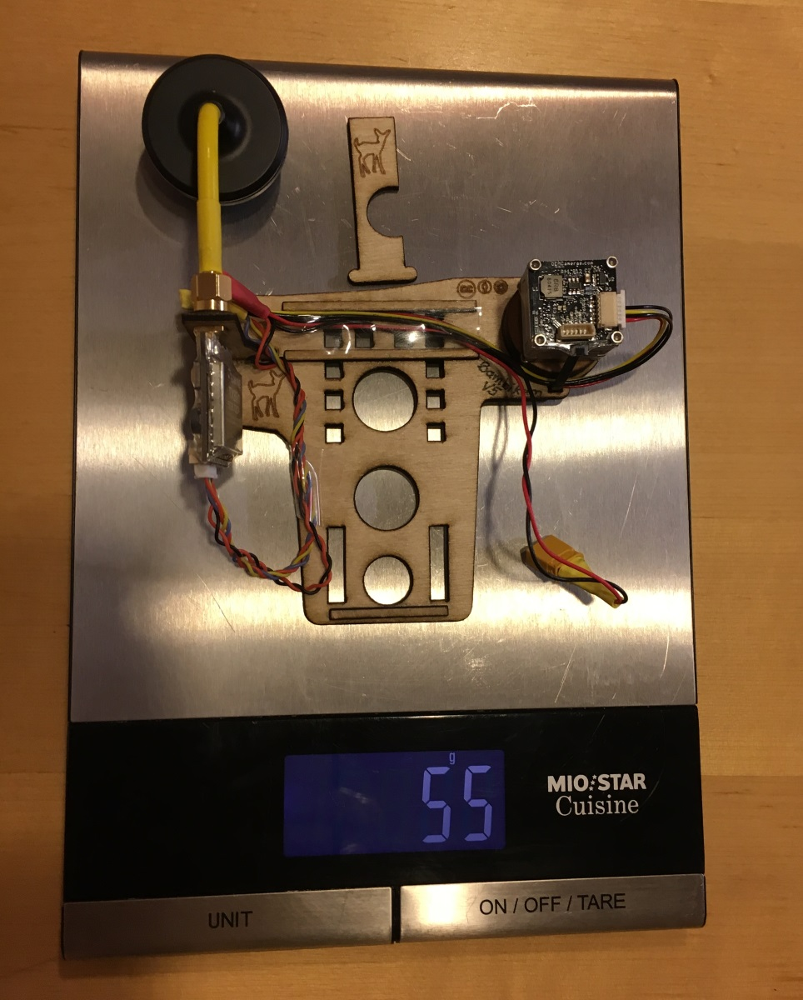
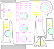

# BambiKam

## Was ist BambiKam?

BambiKam ist eine Plattform, welche es erlaubt eine FLIR BOSON Wärmebildkamera zusammen mit einem Eachine TX801-Sender und eine Cloverleaf-Antenne an eine DJI Mavic Pro/Platinum zu befestigen.

## Für was ist BambiKam gedacht?

BambiKam wurde für die Rehkitzsuche entworfen.

## Bilder! Ich will sehen wie's aussieht

## Was zeichnet BambiKam aus?

* Inklusive Kamera, Sender und Antenne beträgt das Gewicht unter 60 Gramm.

* Durch das Anbringen der Kamera, Sender und Antenne auf der Seite kann auf Fussverlängerungen verzichtet werden. Dies spart ebenfalls Gewicht und macht die Drohne nicht höher.
* Durch die einfache Befestigung der Grundplatte an den hinteren Landekufen der Mavic ist es ganz einfach, die BambiKam zu entfernen und ganz normal zu fliegen.
* Die Grundplatte hat Löcher, welche die Abstandssensoren der Mavic nicht beeinträchtigen. So ist es möglich, auch nach dem Anbringen der BambiKam, die Mavic mit Hilfe der Sensoren zu landen.

## Müssen an der Drohne Modifikationen vorgenommen werden?

Durch die Tatsache, dass eine eigene Stromversorgung wiederum Gewicht bedeutet und schon eine Stromversorgung der Drohne vorhanden ist, welche verwendet werden kann, um den Sender und die Kamera mit Strom zu versorgen, ist es ratsam die Stromversorgung des Quadcopters anzuzapfen.

Der Stromverbrauch des Senders und der Kamera ist sehr klein und beeinflusst die Flugzeit minimal.

## Lizenz

BambiKam steht unter der Lizenz [CC BY SA](https://creativecommons.org/licenses/by-sa/3.0/ch/) und darf somit beliebig kopiert, verändert und geteilt werden unter der Bedingung, dass diese Änderungen wiederum geteilt werden und ein Hinweis auf das Ursprungsprojekt gegeben wird.

Es wird keine Verantwortung übernommen.

## Beschaffung der Materialien

### Aviatik-Sperrholz 2mm

Der Hauptteil besteht aus Aviatik Sperrholz, 2mm. Dieses erhält man bei Coop Bau&Hobby.
Das Aviatik Sperrholz hat den Vorteil, dass es dünn, sehr stabil und vielschichtig verleimt ist.

### Sperrholz 4mm

Die runden Elemente für die Kamerahalterung sind aus normalem 4mm Sperrholz, was nicht so dicht ist wie das Aviatik-Sperrholz.

### Acrylglas/PMMA 2mm

Die Kamerahalterung ist aus 2mm Acrylglas gefertigt und passt für das Interface von OEMCAMERAS. Der Lochabstand beträgt 18mm.

## Anfertigen der BambiKam

Sind die Materialien beschafft, so lässt sich die Form sehr einfach mit einem LaserCutter schneiden.
Beispielsweise verfügt das [FablabWinti](https://www.fablabwinti.ch/das-lab/ausstattung/lasercutter/) über einen LaserCutter. (Neue Mitglieder sind immer herzlich willkommen!)

### Lasern der einzelnen Materialien

#### Lasern von Aviatik-Sperrholz 2mm

Das SVG [BambiKam_Aviatik_Sperrholz_2mm.svg](plan/BambiKam_Aviatik_Sperrholz_2mm.svg) soll folgendermassen gelasert werden:

| Reihenfolge | Farbe    | Geschwindigkeit | Intensität |
| ----------- | -------- | --------------- | ---------- |
| 1           | Gelb     | 1000            | 3%         |
| 2           | Türkis   | 1000            | 75%        |
| 3           | Hellgrün | 1000            | 75%        |
| 4           | Pink     | 1000            | 75%        |
| 5           | Schwarz  | 1000            | 75%        |

#### Lasern von Sperrholz 4mm

Das SVG [BambiKam_Sperrholz_4mm.svg](./plan/BambiKam_Sperrholz_4mm.svg) soll folgendermassen gelasert werden:

| Reihenfolge | Farbe   | Geschwindigkeit | Intensität |
| ----------- | ------- | --------------- | ---------- |
| 1           | Pink    | 1000            | 60%        |
| 2           | Schwarz | 1000            | 60%        |

#### Lasern von Acrylglas/PMMA 2mm

Das SVG [BambiKam_Kamerahalter_Acrylglas_2mm.svg](./plan/BambiKam_Kamerahalter_Acrylglas_2mm.svg) soll folgendermassen gelasert werden:

Für den einfachen Halter:

| Reihenfolge | Farbe   | Geschwindigkeit | Intensität |
| ----------- | ------- | --------------- | ---------- |
| 1           | Pink    | 1000            | 50%        |
| 2           | Schwarz | 1000            | 50%        |

Für den Halter, der die Kamera ganz umfasst:

| Reihenfolge | Farbe | Geschwindigkeit | Intensität |
| ----------- | ----- | --------------- | ---------- |
| 1           | Blau  | 1000            | 50%        |
| 2           | Rot   | 1000            | 50%        |

### Nachbearbeitung

Die einzelnen Elemente müssen nach dem Lasern nachbearbeitet werden, damit diese passen:

#### Kamerahalter aus Acrylglas

Die Löcher müssen mit einem 1.5er Bohrer nachgebohrt werden, bis die Schrauben der FLIR Boson gut reinpassen.

#### Elemente aus Aviatik-Sperrholz 2mm

##### Kleine Scheibe mit Loch mit Durchmesser 6 mm

Die kleine Scheibe mit dem Loch mit Durchmesser von 6 mm muss mit einem Schleifpapier soweit flach geschliffen werden, dass diese aufgeklebt auf den Mast dem Sender und der Antenne guten Halt bieten. Meiner Erfahrung nach sollte die Dicke etwas 1 mm betragen.

### Kleben der einzelnen Elemente

#### Abstandhalter auf Grundplatte (Mitte)

Die Abstandhalter stellen einen Abstand zur Drohne her, damit unter dieser die Luft etwas besser zirkulieren kann und zusätzlich die Kabel zwischen der Grundplatte und der Drohne durchgeführt werden können.

#### Rohr auf Grundplatte (Rechts)

Auf die Grundplatte werden zwei Sperrholzringe (Dicke 4mm, Durchmesser 2cm) auf das Loch geklebt. Es ist wichtig darauf zu achten, dass die Übergänge möglichst nicht spürbar sind und ein durchgängiges "Rohr" mit dem Durchmesser von 2cm entsteht.

Es kann hierzu ein herkömlicher Holzleim verwendet werden.

Sollte sich die Kamera nicht leicht einschieben lassen, so kann mit einem ganz feinen Schleifpapier die vielleicht noch vorhanden Unebenheiten weggeschliffen werden.

#### Mast auf Grundplatte (Links)

Die Stützelemente und der eigentliche Mast, worauf noch die kleine Scheibe mit Durchmesser 6mm draufgeklebt wird, bilden die Halterung für den Sender und die Antenne.

Da die Elemente voneinander abhängen und relativ rasch halten müssen, empfiehlt es sich hier einen holztauglichen Sekundenleim zu verweden.
Wichtig ist, an der Luft trocknen: So verbleiben keine weissen Absonderungen des Sekundenleimes am Holz.

## Montage der Elemente auf der Grundplatte

### Kamera montieren

Der Kamerahalter wird auf der Seite montiert, wo die Buchse angebracht ist, welche mit der Öffnung nach oben zeigt.

Der Kamerahalter wird mit den mitgelieferten Schrauben befestigt und mit Kabelbindern an der Grundplatte befestigt.

Es werden dabei zwei Kabelbinder benötigt:
* Einem Kabelbinder wird der Binderkopf so zerschnitten, dass noch ein wenig davon übersteht und als Begrenzung dient.
* Einem weiteren Kabelbinder wird der Binderkopf komplett abgeschnitten.

Die Kamera wird anschliessend mit der Linse nach unten und der Kamerahalterung Richtung Heck in das Rohr eingelegt. (Falls es nicht passt, wie oben beschrieben, mit einem Streifen feinem Schleifpapier etwas nachschleifen.)

### Sender und Antenne montieren

Die holzige Unterlagscheibe, welche schon flachgeschliffen wurde, am Mast anbringen und gut anziehen. Die Antenne soll dabei nach vorne zeigen.

### Verlegen der Kabel

Die Kabel können durch den doppelt vorhandenen Abstandhalter gelegt werden und der Einfachheit halber einfach mit einem Streifen Klebeband befestigt werden.

## Anbringen der Grundplatte an den Kopter

Am besten legt man die Mavic auf den Rücken und legt die Grundplatte mit der Kamera nach unten zeigend so auf die Landekufen, dass sie durch die vertikalen Aussparungen zeigen. Die Befestigung der Grundplatte erfolgt durch das Einschieben des Splintens mit der Aussparung. Wichtig ist, dass der Splinten von links eingeschoben wird, da so die Kamera nicht verdeckt wird.

## Fliegen