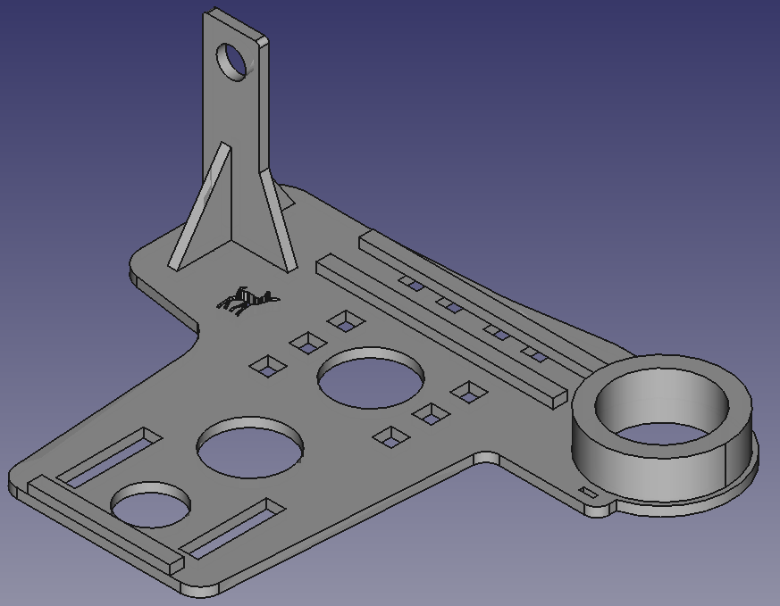

# BambiKam

## Was ist BambiKam?

BambiKam ist eine Plattform, welche es erlaubt eine FLIR BOSON Wärmebildkamera zusammen mit einem Eachine TX801-Sender und eine Cloverleaf-Antenne an eine DJI Mavic Pro/Platinum zu befestigen.

## Für was ist BambiKam gedacht?

BambiKam wurde für die Rehkitzsuche entworfen.

## Was zeichnet BambiKam aus?

* Inkl. Kamera, Sender und Antenne beträgt das Gewicht unter 60 Gramm.

## Lizenz

BambiKam steht unter der Lizenz [CC BY SA](https://creativecommons.org/licenses/by-sa/3.0/ch/) und darf somit beliebig kopiert, verändert und geteilt werden unter der Bedingung, dass diese Änderungen wiederum geteilt werden und ein Hinweis auf das Ursprungsprojekt gegeben wird.

## Beschaffung der Materialien

### Aviatik-Sperrholz 2mm

Der Hauptteil besteht aus Aviatik Sperrholz, 2mm. Dieses erhält man bei Coop Bau&Hobby.
Das Aviatik Sperrholz hat den Vorteil, dass es dünn, sehr stabil und vielschichtig verleimt ist.

### Sperrholz 4mm

Die runden Elemente für die Kamerahalterung sind aus normalem 4mm Sperrholz, was nicht so dicht ist wie das Aviatik-Sperrholz.

### Acrylglas/PMMA 2mm

Die Kamerahalterung ist aus 2mm Acrylglas gefertigt.

## Anfertigen der BambiKam

Sind die Materialien beschafft, so lässt sich die Form sehr einfach mit einem LaserCutter schneiden.
Beispielsweise verfügt das [FablabWinti](https://www.fablabwinti.ch/das-lab/ausstattung/lasercutter/) über einen LaserCutter. (Neue Mitglieder sind immer herzlich willkommen!)

### Lasern der einzelnen Materialien

#### Lasern von Aviatik-Sperrholz 2mm

Das SVG [BambiKam Aviatik Sperrholz 2mm.svg](../plan/BambiKam Aviatik Sperrholz 2mm.svg) soll folgendermassen gelasert werden:

| Reihenfolge | Farbe | Geschwindigkeit | Intensität |
| --- | --- | --- | --- |
| 1 | Gelb | 1000 | 3% |
| 2 | Türkis | 1000 | 75% |
| 3 | Hellgrün | 1000 | 75% |
| 4 | Pink | 1000 | 75% |
| 5 | Schwarz | 1000 | 75% |

#### Lasern von Sperrholz 4mm

Das SVG [BambiKam Sperrholz 4mm.svg](../plan/BambiKam Sperrholz 4mm.svg) soll folgendermassen gelasert werden:

| Reihenfolge | Farbe | Geschwindigkeit | Intensität |
| --- | --- | --- | --- |
| 1 | Pink | 1000 | 60% |
| 2 | Schwarz | 1000 | 60% |

#### Lasern von Acrylglas/PMMA 2mm

Das SVG [BambiKam Kamerahalter Acryl 2mm.svg](../plan/BambiKam Kamerahalter Acryl 2mm.svg) soll folgendermassen gelasert werden:

Für den einfachen Halter:

| Reihenfolge | Farbe | Geschwindigkeit | Intensität |
| --- | --- | --- | --- |
| 1 | Pink | 1000 | 50% |
| 2 | Schwarz | 1000 | 50% |

Für den Halter, der die Kamera ganz umfasst:

| Reihenfolge | Farbe | Geschwindigkeit | Intensität |
| --- | --- | --- | --- |
| 1 | Blau | 1000 | 50% |
| 2 | Rot | 1000 | 50% |

### Nachbearbeitung

Die einzelnen Elemente müssen nach dem Lasern nachbearbeitet werden, damit diese passen:

