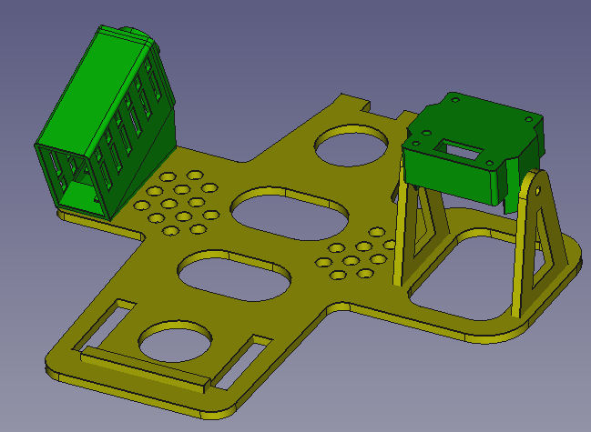

# BambiKam

> Quicklinks zu den aktuellen Versionen:
> - [BambiKam Easy V8.11](BambiKamEasy/BambiKamEasyV8.11)

- [BambiKam für DJI Mavic Pro (Platinum)](#bambikam-für-dji-mavic-pro-platinum)
- [BambiKam für DJI Mavic 2 Pro/Zoom](#bambikam-für-dji-mavic-2-prozoom)
- [Was ist BambiKam?](#was-ist-bambikam)
- [Zeig her die Bilder! Ich will sehen wie's aussieht!](#zeig-her-die-bilder-ich-will-sehen-wies-aussieht)
  - [Bilder der BambiKam Easy](#bilder-der-bambikam-easy)
- [Was zeichnet BambiKam aus?](#was-zeichnet-bambikam-aus)
  - [BambiKam Easy](#bambikam-easy)
- [Müssen an der Drohne Modifikationen vorgenommen werden?](#müssen-an-der-drohne-modifikationen-vorgenommen-werden)
- [Kann die BambiKam Easy auch an die Mavic 2 befestigt werden?](#kann-die-bambikam-easy-auch-an-die-mavic-2-befestigt-werden)
- [Versionen](#versionen)
  - [Archiv](#archiv)
- [Warum sieht die BambiKam Easy so spartanisch aus?](#warum-sieht-die-bambikam-easy-so-spartanisch-aus)
- [Lizenz](#lizenz)

## BambiKam für DJI Mavic Pro (Platinum)

## BambiKam für DJI Mavic 2 Pro/Zoom

## Was ist BambiKam?

BambiKam ist eine Plattform, welche es erlaubt eine [FLIR BOSON](http://www.flir.de/cores/boson/) Wärmebildkamera zusammen mit einem [Eachine TX801-Sender](https://www.google.com/search?q=eachine%20tx801) und einer [Cloverleaf](https://www.google.com/search?q=align+cloverleaf+5.8+ghz)-Antenne an eine [DJI Mavic Pro/Platinum](https://www.google.com/search?q=dji+mavic+pro+platinum) oder an eine [DJI Mavic 2 Pro/Zoom](https://www.google.com/search?q=dji+mavic+2+pro) zu befestigen.

Wahlweise ist es auch möglich, einen [SpeedyBee VTX-DVR](https://www.speedybee.com/speedy-bee-vtx-dvr/)-Transmitter zu verwenden. Dieser erlaubt es, das Videosignal direkt auf eine MicroSD-Karte aufzuzeichnen. Dazu muss das alternative Gehäuse verwendet werden. Die Grundplatte ist identisch.  (Hinweis: Dieser Transmitter hatte zu wenig Absatz und wird deshalb von der Herstellerfirma nicht mehr produziert.)

## Zeig her die Bilder! Ich will sehen wie's aussieht!

### Bilder der BambiKam Easy

[Bilder der BambiKam Easy](BambiKamEasy/BambiKamEasyV8#zeig-her-die-bilder-ich-will-sehen-wies-aussieht)

## Was zeichnet BambiKam aus?

### BambiKam Easy

- Inklusive Kamera, Sender und Antenne beträgt das Gewicht weniger als 65 Gramm.
- Durch das Anbringen der Kamera, Sender und Antenne auf der Seite kann auf Fussverlängerungen verzichtet werden. Dies spart ebenfalls Gewicht und macht die Drohne nicht höher.
- Durch die einfache Befestigung der Grundplatte an den hinteren Landekufen der Mavic ist es ganz einfach, die BambiKam zu entfernen und die Drohne als ganz normale Drohne zu verwenden.
- Die Grundplatte hat Löcher, welche die Sensoren der Mavic nicht beeinträchtigen. So ist es möglich, auch nach dem Anbringen der BambiKam, die Mavic mit Hilfe der Sensoren zu landen.

## Müssen an der Drohne Modifikationen vorgenommen werden?

Durch die Tatsache, dass eine eigene Stromversorgung wiederum Gewicht bedeutet und schon eine Stromversorgung der Drohne vorhanden ist, welche verwendet werden kann, um den Sender und die Kamera mit Strom zu versorgen, ist es eine Überlegung wert, die Stromversorgung des Quadcopters anzuzapfen. Selbstverständlich muss man sich der Tatsache bewusst sein, dass dies Auswirkung auf die Herstellergarantie hat.

Der Stromverbrauch des Senders und der Kamera ist sehr klein und beeinflusst die Flugzeit minimal.

Alternativ kann auch auf kleine Akkus zurückgegriffen werden und die BambiKam so ohne Drohnenmodifikation betrieben werden.

## Kann die BambiKam Easy auch an die Mavic 2 befestigt werden?

Ja, die BambiKam Easy ist nun auch an die die Mavic 2 angepasst und die Beschreibung wurde entsprechend erweitert.

## Versionen

Die BambiKam wird stetig weitergepflegt. Folgende Versionen sind bisher erschienen:

- [BambiKam Easy V8.11](/BambiKamEasy/BambiKamEasyV8.11): Die Grundplatte wurde überarbeitet.

### Archiv

- [BambiKam Easy V5](/BambiKamEasy/BambiKamEasyV5): Erste veröffentlichte Version. Senkrechte, fixe Kameraeinstellung.
- [BambiKam Easy V6](/BambiKamEasy/BambiKamEasyV6): Kameraeinstellung kann bis 10° geneigt werden.
- [BambiKam Easy V8](/BambiKamEasy/BambiKamEasyV8): Das Transmittergehäuse wurde überarbeitet und wird direkt auf die Grundplatte aufgeklebt. Die Lüftung des Transmitters wurde ebenfalls verbessert. Die Löcher für die Ultraschall-Sensoren und Kameras wurden vergrössert.
- [BambiKam Easy V8.10](/BambiKamEasy/BambiKamEasyV8.10): Die Grundplatte wurde überarbeitet.- [BambiKam Pro V2](/BambiKamPro/BambiKamProV2): Aufhängung für 2-Achsen-Gimbal

## Warum sieht die BambiKam Easy so spartanisch aus?

> "Perfektion ist nicht dann erreicht, wenn es nichts mehr hinzuzufügen gibt, sondern wenn man nichts mehr weglassen kann."

-- <cite> Antoine de Saint-Exupéry, Terre des Hommes, III: L'Avion, p. 60 (1939)</cite>

Treffender kann man es nicht beschreiben.

## Lizenz

BambiKam steht unter der Lizenz [CC BY SA](https://creativecommons.org/licenses/by-sa/3.0/ch/) und darf somit beliebig kopiert, verändert und geteilt werden unter der Bedingung, dass diese Änderungen wiederum geteilt werden und ein Hinweis auf das Ursprungsprojekt gegeben wird.

Es wird keine Verantwortung übernommen.
